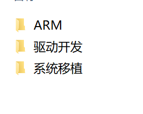

# 一、开班


一、自我介绍


刘兴


二、课程介绍





三、来华清意味着什么

认真学习，找份好工作


四、学习建议

多练，多问，多记笔记，多复习


五、上课时间

8:30 - 12:00

14:00 - 17:00


后面阶段：晚自习 18:30 - 20:30


六、环境介绍

小区周围饭店，小吃街


七、软件安装

vmware,ubuntu


# 二、前言

## 嵌入式是什么


**嵌入式产品**


# 三、linux系统基础


## 1. linux系统和windows系统的区别


```c
/ 根目录   
/bin 存放着最常用的程序和指令 Binary 比如 ls 就是在/bin/ls 目录下的。
/boot 内核和启动文件
/dev 设备文件 Device 注意：在Linux中访问设备和访问文件的方式是相同的。
/etc 配置文件（账户，主机名） 和子目录列表，更改目录下的文件可能会导致系统不能启动。
/home 用户主目录的默认位置
/lib 共享的库文件
/root 超级用户的主目录    
```

```c
/      ------//表示根目录，是linux最高一级目录，linux中所有文件都在根目录下存放
home   ------//表示家目录，linux系统为多用户系统，该目录中会创建与每个用户同名的文件夹，这些文件夹代表每个用户的家目录，如：farsight用户，在home中有同名的farsight家目录。
注意：每个用户只有在自己的家目录中才有各种操作权限，在其他目录一般没有权限操作
其他目录属于系统级目录，普通用户没有权限操作，只有超级用户(root用户)才能操作
```


## 2. linux系统常用命令

**创建文件选项**


```c

终端常用命令

pwd:查看当前的绝对路径    

绝对路径：以/开头的路径

相对路径：以. 或者 ..开头的路径

ls: 查看当前路径下的文件

    ls -a: 查看当前路径下的隐藏文件

        .   : 本级目录
        ..  ： 上一级目录   

mkdir : 创建目录
示例：mkdir c          
            
cd : 跳转命令
示例：cd c
 	 cd .. 返回上一级目录   


如果在day1目录，怎么返回家目录？    
    1. cd ../..
	2. cd /home/hqyj
	3. cd ~
    4. cd回车
 
    
上方向键：查找之前输入过的命令

清屏： ctrl + l   或者 终端输入clear
    
touch:创建文件    
示例：touch 1.txt    
    
rm :删除文件
示例：rm 1.txt    
    
rmdir : 删除空的目录    
示例：rmdir aaa    

rm -r: 递归删除    
示例：rm -r bbb
    
cp:复制文件  源文件 目标文件
示例： cp 1.txt 2.txt   
    
cp -r:复制目录 源目录 目标目录    
示例： cp -r aa bb    

mv: 重命名 移动
示例： mv 原文件名 目标文件名
      mv 1.c my.c

     移动文件到目录中： mv my.c aa
     移动目录到目录中： mv aa bb
    
    
    
```


## 三、vim编辑器

### 1. 配置vim

```c
1. 把20.04配置中的vim和vimrc复制到家目录

2. rm .vimrc
    
3. mv vimrc .vimrc

4. mv vim .vim
```


### 2. 使用vim

```c
1. vim 01.c
2. 按i进入插入模式 （写代码）
    i:在光标的位置插入
    o:在光标的下一行位置插入
    a:在光标的下一个位置插入
        
3. 输入main，按tab键，自动补全
4. 写完代码之后，按ESC退出插入模式
5. shfit+:wq (保存代码)  

    shfit+: w   保存
    shfit+: q   退出
    shfit+: q！ 强制退出
    shfit+: x   保存+退出

终端输入cat 01.c
#include <stdio.h>
#include <stdlib.h>
#include <string.h>

int main(int argc, const char *argv[])
{
	printf("hello world\n");
	return 0;
}    
```


## 四、gcc编译器

gcc是超级编译器，可以编译多种语言的程序，也可以编译不同平台下的程序，如：支持arm架构，x86架构

```c
gcc 01.c  (编译代码，生成a.out可执行文件)
    
./a.out   (运行程序)   
    
    
gcc 01.c -o xxx  把a.out重命名为xxx    
```


```c
当我们用gcc编译c程序时，实际上gcc内部会经过4个步骤：

  ① 预处理   ：gcc -E hello.c -o hello.i

  ② 编译     ：gcc -S hello.i -o hello.s

  ③ 汇编     ： gcc -c hello.s -o hello.o

  ④ 链接     ：gcc hello.o -o hello
```


## 五、网络配置

### 1.配置windows网络


**自动寻找IP地址**


**手动设置静态IP**


### 2.配置linux网络


## 六、典型C程序实例概览

### 1. 一个简单的Linux C程序实例分析

```c
#include <stdio.h>

/*
  一个简单的Linux C程序
*/
int main(void) //main函数的返回类型为int型
{ 
    //函数体左右花括号各独占一行，函数体注意缩进
    int num; //定义一个int型变量，语句必须以分号 ” ; ” 结尾
    num = 1; //对变量赋值
    char *pstring = “hello world”; //定义一个char *变量并初始化之
    for(num=0; num<7; num++) //for循环语句
    { 
        printf(“%s\n”, pstring); // 代码块统一缩进
    }
    return 0;
}

```


### 2. LINUX C编程风格 

​	1》适当的空行和空格，空行一般可以出现在逻辑块之间。 

​	2》一定要有缩进，代码块中的代码一定要缩进，无论是函数体、循环体、 switch多路分支和普通复合语句。（注意，C语言是一种“自由体”语言，程序中的所有空白符都与逻辑无关，只起排版作用，因此空行缩进等格式 对语法来说不是必须的） 

​	3》适当的注释，程序具有一定逻辑和算法复杂度的时候，在关键的地方做好注释。写注释是一种修养。（注意，注释要写代码的功能，而不是其原理） 

​	4》最好按照规范写代码，代码不仅自己将来要看，而且经常是要给别人看的，不要自成一体


### 3. linuxC中主函数的格式

1》第一种格式：		

```c
int   main(void)
{
	//从此处开始写其他代码
	.....
	return 0;
}
```

2》第二种格式：

```c
int   main(int argc,char *argv[])
{
	//从此处开始写其他代码
	.....
	return 0;
}
```

//注意：除了上面两种格式外，其他的格式在linuxc中都是不规范的。


### 4. linuxC中的return语句

1》在主函数(main)中使用

​		1）表示结束程序

​		2）返回到系统中

​	例如：	

```c
#include <stdio.h>

int main(void)
{
	printf("我是第一条语句\n");     //可以打印到屏幕上
	return 0;
	printf("我是第二条语句\n");	//不能打印到屏幕上
}
```

2》在其他函数中使用

​		1）表示结束函数的执行

​		2）返回到函数调用的位置

例如： 	

```c
#include <stdio.h>

int fun(void)
{
        printf("我是一个非主函数\n");			//可以打印到屏幕上
        return 0;
        printf("我是一个非主函数中的另一条语句\n");  //不能打印到屏幕上
}

int main(void)
{
        fun();
        return 0;
}

```


