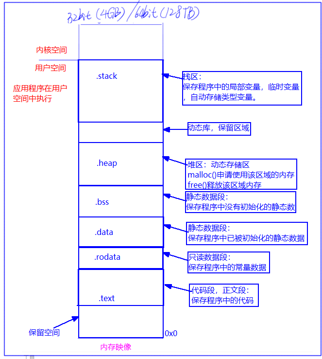

# 复习

```
struct:用户自定义的一种数据类型

用来描述对象

大象{
	属性1;
	属性2;
	属性3;
	属性4;
	......
}

结构体保存不同的数据类型

typedef struct 结构体名{


}xxx;

struct 结构体名 == 数据类型


gcc 1.c -o xxx   

./xxx  == ./a.out

eg:
typedef struct Person{
	char name[30];
	char ch;
	int age;
	float height;
	......
}xxx;

xxx per = {"zhangsan", 'm', 18, 1.83}; 

访问成员:
per.name  %s
per.ch    %c

给成员赋值：
per.age = 81;
per.height = 1.38


xxx *p = &per;

p->name    <==>   (*p).name


xxx pers[10];  //[元素的个数]  有10个元素  意思就是有10个人

for(int i=0; i<10; i++)
{
	scanf("%s", &pers[i].name);
	scanf("%c", &pers[i].ch);
	scanf("%d", &pers[i].age);
	scanf("%f", &pers[i].height);
}


struct A{
	char b;
	int a;
	short c;
	double d;
};

sizeof(struct A); //结构体占内存的空间大小

总结：以最高的字节对齐


union B{
	int a;
	char b;
	short c;
}；

sizeof(union 共用体名) = 4bytes

union B b;

b.a = 97;  //给一个成员赋值，另外的成员也会被赋值


```


# 一，内存映像

在linux中，运行c程序时，系统会给当前的c程序映射一个独立的虚拟的内存空间，该c程序就在这样的虚拟内存中执行，把映射的这块虚拟内存称为内存映像，如下图：





# 二，存储类型

在C语言中，当定义一个变量时，需要说明该变量的数据类型，

比如：int  a;      //int 用于说明a在内存中占4个字节空间，空间中保存的数据以二进制补码形式存放。

当时，对应定义的a来说，我们还不知道a在内存的哪个位置分配空间，也不知道该空间什么是否被释放，也不知道a在程序中哪里可以用，哪里不能用。像这些问题，需要通过数据的存储类型来加以说明。


## 2.1 存储类型的分类

​		1》自动存储类型

​		2》寄存器存储类型

​		3》全局非static静态存储类型

​		4》全局static静态存储类型

​		5》局部static静态存储类型

​		6》外部存储类型


## 2.2 存储类型如何定义变量(数据)

​																	定义位置    					定义形式

​		1》自动存储类型							   代码块内						int   a;

​		2》寄存器存储类型						   代码块内						register  int a;

​		3》全局非static静态存储类型		  代码块外						int a;

​		4》全局static静态存储类型			  代码块外						static  int a;

​		5》局部static静态存储类型			  代码块内						static  int a;

​		6》外部存储类型							   代码块内(声明)			  extern int a;


## 2.3 不同存储类型的特点

​																内存中位置 	 生存周期                               作用域

​		1》自动存储类型							栈					 定义----代码块结束			代码块作用域

​		2》寄存器存储类型						寄存器/栈		定义 ----代码块结束			代码块作用域

​		3》全局非static静态存储类型	   .data/.bss		定义----程序结束				多文件作用域

​		4》全局static静态存储类型		   .data/.bss		定义----程序结束				单文件作用域

​		5》局部static静态存储类型		   .data/.bss		定义----程序结束				代码块作用域

​		6》外部存储类型							.data/.bss		定义----程序结束				多文件作用域


例如： 

```

总结一下：

1. 局部变量 auto 可以省略 在代码块有效
2. 全局变量 在程序内有效
3. static修饰的局部变量：延长生命周期
4. static修饰的全局变量：限制作用域，只能在本文件使用
5. static修饰的函数：限制作用域，只能在本文件使用
6. 寄存器 register 经常使用的数据 因为寄存器是有限的
7. extern外部存储： 引用外部文件的全局变量/函数 extern int m; 
										  extern void xxx(void);
	


```


# 三，内存管理

​	所谓内存管理指的是堆空间的申请和释放。 malloc free


## 1，堆空间和栈空间的区别


### 	1.1 栈

​			1》有名空间，可以通过变量名或数组名访问

​			2》空间的申请和释放由系统管理

​			3》存取数据的效率较高

​			4》栈空间较小

### 	1.2 堆

​			1》无名空间，只能通过指针访问

​			2》空间的申请用malloc(),释放用free()，由程序员自己管理

​			3》存取数据的效率较低

​			4》堆空间较大


## 2， 申请堆空间

通常，通过调用malloc()函数申请堆中的内存空间：

```c
#include <stdlib.h>
void *malloc(size_t size);
功能：申请堆空间
参数:
	size:申请空间的大小

返回值： void * 
```

 注意事项：
    1》 void* 表示返回的地址没有确定类型，所以返回时需要对这个地址强制类型转换，转成具体的指针类型。
    2》 malloc申请的空间是连续的
    3》 malloc申请的空间没有初始化，空间中为随机值


例如： 在堆中申请一个int的空间，保存一个整数

```


```


例如：在堆中申请int型数组空间，保存5个整数

```


```


例如：在堆中申请字符数组空间，保存一个字符串

```


```


## 3， 释放堆空间

```c
void free(void *ptr);
功能：释放空间
参数：
    void * malloc的返回值
```

使用时注意：

​	1》不能释放申请的空间中的一部分

​	2》不能给free传NULL,无意义

​	3》不能重复释放同一块堆空间

​	4》堆空间被释放后，不能再使用，如果再使用，则属于非法使用，会造成不可预料的结果

例如：

```


```


​	  