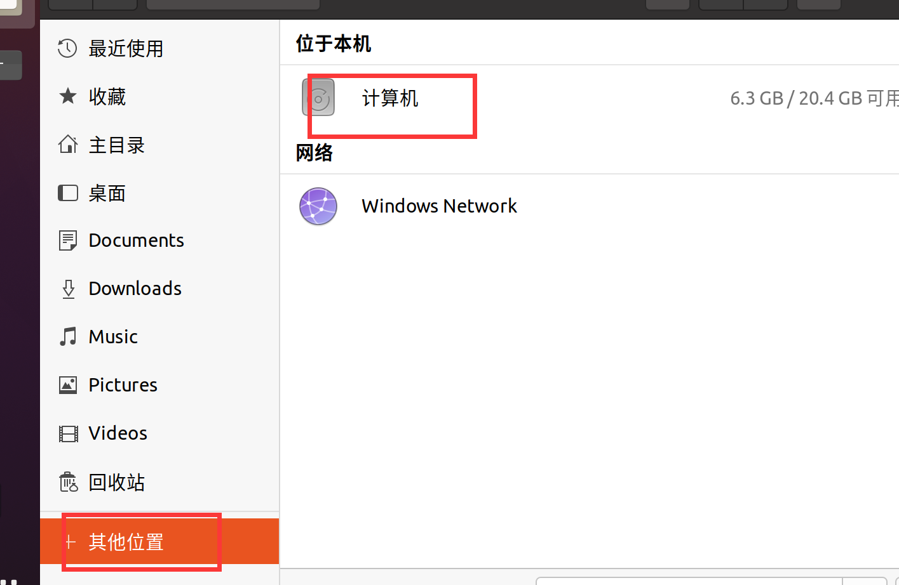
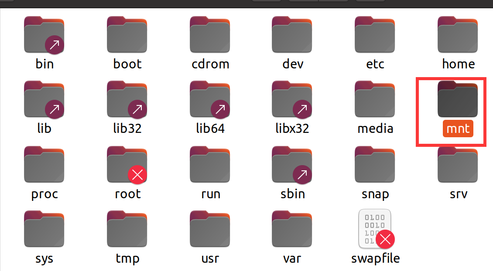
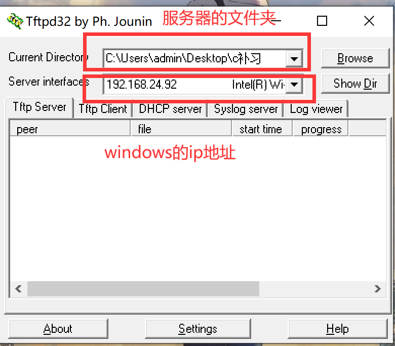
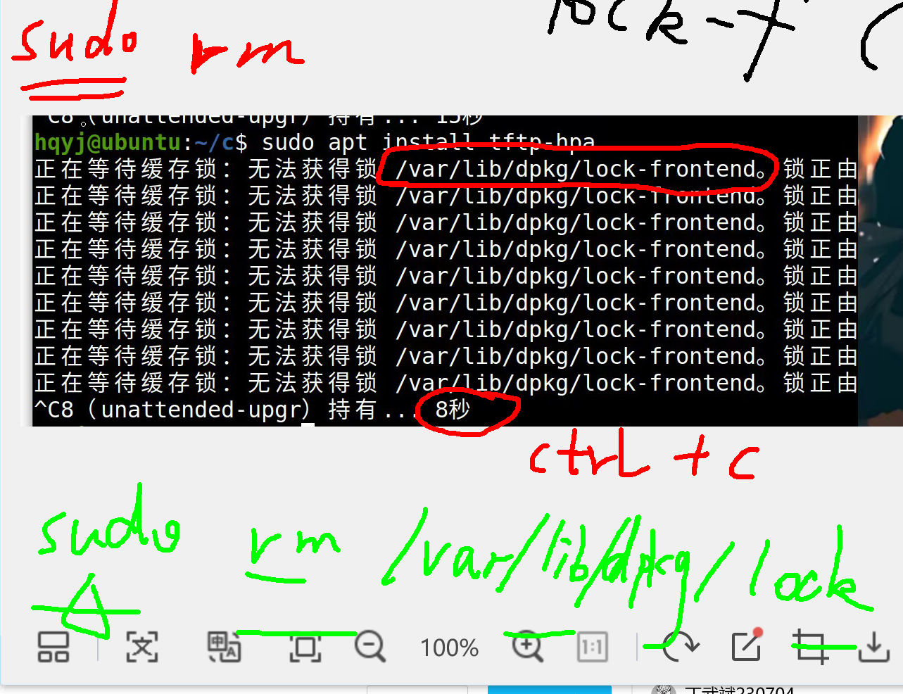
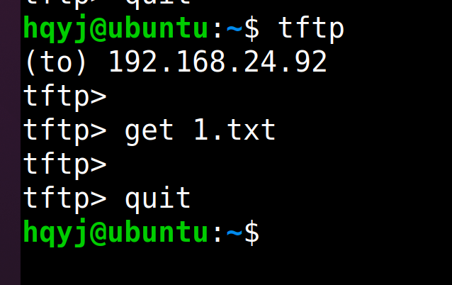
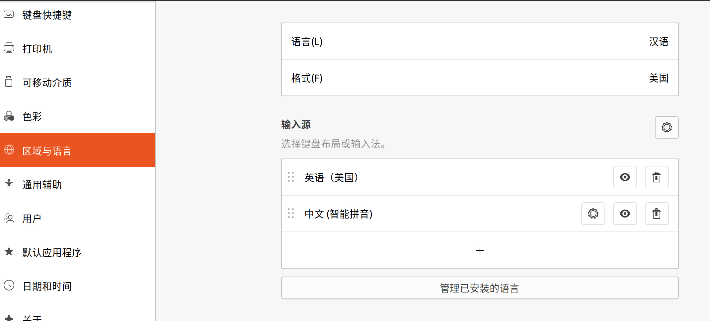
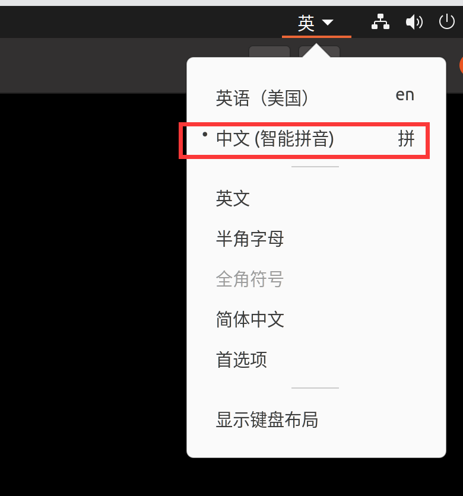
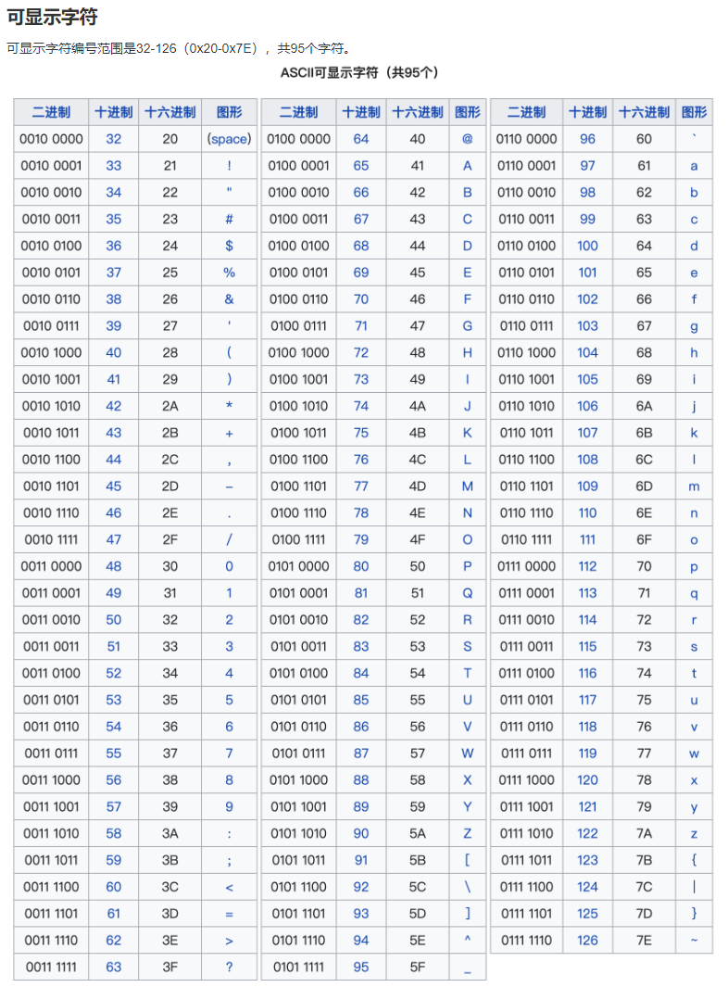
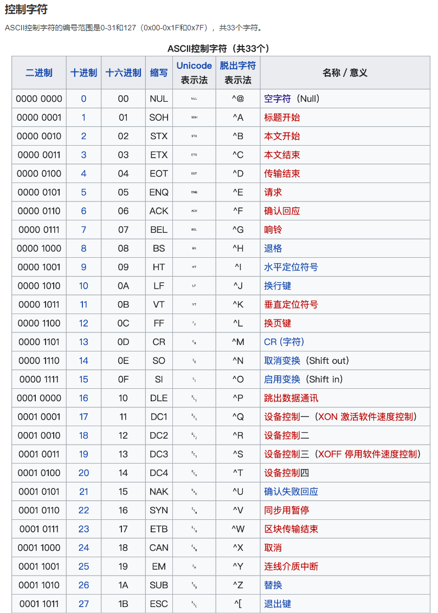

|  | col2 | col3 |
| - | ---- | ---- |
|  |      |      |
|  |      |      |

# 复习

```
linux系统常用命令：
 
    pwd   ls 

绝对路径：以/开头
相对路径：以 .  ..开头

ls -a     cd 跳转   

mkdir day1   rmdir day1

touch 1.txt 1.c 1.sh 1.cpp 

rm 1.txt 1.c 1.sh 1.cpp

如果目录中有东西 ，rmdir(x)   , rm -r 递归删除 目录名

上方向键：查找之前输入过的命令

cp 复制文件   
示例： cp 源文件名  目标文件名
cp 1.txt 2.txt

cp -r 复制目录  
示例： cp 源目录名  目标目录名
cp day1 day2

mv: 重命名  移动

mv 1.txt 2.txt

mv day1 xxx (重命名)

mv 1.txt day1

mv day1 day2

vim编辑器
	1. 配置
	2. 使用

vim 01.c

按i进入插入模式（写代码）

main按tab键

printf("hello\n");

按esc键退出插入模式

按shfit+:wq

01.c保存成功


gcc 01.c --> a.out --> ./a.out

gcc 01.c -o xxx --> xxx --> ./xxx


配置网络：目的是为了让虚拟机能够联网


```

**windows和ubuntu复制粘贴**

1.ctrl+c   ctrl+v

2.虚拟机-->设置-->选项-->共享文件夹






3.Tftp服务器

步骤：

1. 打开windows版本的tftp服务器 （软件）
2. 



3. 需要在ubuntu中下载tftp客户端

       sudo apt install tftp-hpa



4. tftp回车 ， 输入服务器的ip地址， get 文件名可以下载文件



ps : 下载文件夹（需要百度配置流程）

# 一、 C程序

## 1. 一个简单的Linux C程序实例分析

```c
#include <stdio.h>  //输入输出的头文件 printf scanf

/*
  一个简单的Linux C程序
*/

#if 0

pritnf("hello\n");

#endif

int main(void) //main函数的返回类型为int型
{ 
    //函数体左右花括号各独占一行，函数体注意缩进
	int num; //定义一个int型变量，语句必须以分号 ” ; ” 结尾
    num = 1; //对变量赋值
  
    return 0; //结束程序
}

```

使用vim编辑器

```c
1. 插入模式 (写代码)
	i
	o
	a

2. 命令行模式（esc退出插入模式）

dd  :剪切光标所在的那一行

u: 撤销

ctrl + r :反向撤销

yy: 复制光标所在的那一行

p：粘贴

nyy: 复制n行
ndd: 剪切n行

鼠标选中区域，按y, 复制
鼠标选中区域，按d, 剪切

鼠标选中区域，按=可以自动缩进
gg=G  把所有代码都缩进一下

gg:跳到第一行
G：跳到最后一行


3. 底行模式（shift+:进入底行模式）

w

q

q!

wq

x

查找字符串：

/字符串

n 下一个

N 上一个

替换字符串：
%s/旧/新/g  把文件中所有的旧字符串都替换成新字符串

s/旧/新/g  把光标所在的那一行的旧字符串替换成新字符串


快速跳转：冒号后面跟行数

```

**修改vim配色方案：**

```c
/home/hqyj/.vim/colors   保存配色的路径

/home/hqyj/.vimrc   配置文件 （进去修改即可）  
```





**按shift可以中英文切换**

ps: 安装搜狗输入法（linux版本，自行百度）

## 2. LINUX C编程风格

    1》适当的空行和空格，空行一般可以出现在逻辑块之间。

    2》一定要有缩进，代码块中的代码一定要缩进，无论是函数体、循环体、 switch多路分支和普通复合语句。（注意，C语言是一种“自由体”语言，程序中的所有空白符都与逻辑无关，只起排版作用，因此空行缩进等格式 对语法来说不是必须的）

    3》适当的注释，程序具有一定逻辑和算法复杂度的时候，在关键的地方做好注释。写注释是一种修养。（注意，注释要写代码的功能，而不是其原理）

    4》最好按照规范写代码，代码不仅自己将来要看，而且经常是要给别人看的，不要自成一体

## 3. linuxC中主函数的格式

1》第一种格式：

```c
int   main(void)
{
	//从此处开始写其他代码
	.....
	return 0;
}
```

2》第二种格式：

```c
int   main(int argc,char *argv[])
{
	//从此处开始写其他代码
	.....
	return 0;
}
```

//注意：除了上面两种格式外，其他的格式在linuxc中都是不规范的。

## 4. linuxC中的return语句

1》在主函数(main)中使用

    1）表示结束程序

    2）返回到系统中

    例如：

```c
#include <stdio.h>

int main(void)
{
	printf("我是第一条语句\n");     //可以打印到屏幕上
	return 0;
	printf("我是第二条语句\n");	//不能打印到屏幕上
}
```

2》在其他函数中使用

    1）表示结束函数的执行

    2）返回到函数调用的位置

例如：

```c
#include <stdio.h>

int fun(void)
{
        printf("我是一个非主函数\n");			//可以打印到屏幕上
        return 0;
        printf("我是一个非主函数中的另一条语句\n");  //不能打印到屏幕上
}

int main(void)
{
        fun();
        return 0;
}

```

# 二、数据类型

## 1.数据分类

**在linuxC中数据分为两大类：常量数据和变量数据**

### 1.1 常量数据

```c
常量数据 --- 在程序运行过程中值不能被改变的数据称为常量数据，简称常量。
```

### 1.2 变量数据

```c
变量数据 --- 在程序运行过程中值可以被改变的数据称为变量数据，简称变量。
```

## 2.常量

**在LinuxC中常量分为以下几种：**

**因为常量是在程序中不能被改变的数据，所以主要讲常量的使用(在程序中的表示方法)**

### 2.1  整型常量

```c
十进制形式： 100    120  250         //十进制：用0,1,2,3,4,5,6,7,8,9 这10个数字表示的数，逢十进一

八进制形式： 0120  0250             //八进制：用0,1,2,3,4,5,6,7这8个数字表示的数，逢八进一

十六进制形式：0x12  0x34  0xa1  0xb2      //十六进制：用0,1,2,3,4,5,6,7,8,9,A,B,C,D,E,F这16个数字表示的数，逢十六进一

数据在计算机中的存储进制 ：二进制形式             //二进制：用0,1这2个数字表示的数，逢二进一
```

**不同进制之间的转换**

```c
1.十进制 --> 二、八、十六进制
除N，取余，倒排

2.二、八、十六进制 --> 十进制
乘权，相加

3.十六进制 --> 二进制
一位化四位

4.八进制 --> 二进制
一位化三位
  
  
练习：

1. 100 转化成 二进制、八进制、十六进制

2. 0x12、012、10101010 转化成 十进制  
```

### 2.2 浮点型常量

```c
1》浮点表示法

	例如： 3.14  2.56  7.38

2》e计数表示法

	例如：   3.4E2 (3.4x10^2)  

			3.4e2 (3.4x10^2)  

 			3.4E-2 (3.4x10^-2) 
```

### 2.3 字符型常量

```c
在c语言中，字符用单引号' '括起来，表示一个字符

字符分两种：

  1》可见字符 -----能够打印到屏幕上的字符

		例如： 'a'   'b'   'c'   'x'

  2》不可见字符 -----不能够打印到屏幕上的字符,属于功能型字符 

		例如： '\a'    '\b'    '\n'   '\r'

因为计算机中只能存储0和1，对于字符不能直接存储，需要给每个字符编码，存储字符时，实际上存储的是对应的编码值，

在linuxC语言中，用的编码为ASCII码, 它的全称是“美国信息交换标准代码”

详细的ASCII 码表见下：
```

**$ man ascii**

```
       Oct   Dec   Hex   Char                        Oct   Dec   Hex   Char
       ────────────────────────────────────────────────────────────────────────
       000   0     00    NUL '\0' (null character)   100   64    40    @
       001   1     01    SOH (start of heading)      101   65    41    A
       002   2     02    STX (start of text)         102   66    42    B
       003   3     03    ETX (end of text)           103   67    43    C
       004   4     04    EOT (end of transmission)   104   68    44    D
       005   5     05    ENQ (enquiry)               105   69    45    E
       006   6     06    ACK (acknowledge)           106   70    46    F
       007   7     07    BEL '\a' (bell)             107   71    47    G
       010   8     08    BS  '\b' (backspace)        110   72    48    H
       011   9     09    HT  '\t' (horizontal tab)   111   73    49    I
       012   10    0A    LF  '\n' (new line)         112   74    4A    J
       013   11    0B    VT  '\v' (vertical tab)     113   75    4B    K
       014   12    0C    FF  '\f' (form feed)        114   76    4C    L
       015   13    0D    CR  '\r' (carriage ret)     115   77    4D    M
       016   14    0E    SO  (shift out)             116   78    4E    N
       017   15    0F    SI  (shift in)              117   79    4F    O
       020   16    10    DLE (data link escape)      120   80    50    P
       021   17    11    DC1 (device control 1)      121   81    51    Q
       022   18    12    DC2 (device control 2)      122   82    52    R
       023   19    13    DC3 (device control 3)      123   83    53    S
       024   20    14    DC4 (device control 4)      124   84    54    T
       025   21    15    NAK (negative ack.)         125   85    55    U
       026   22    16    SYN (synchronous idle)      126   86    56    V
       027   23    17    ETB (end of trans. blk)     127   87    57    W
       030   24    18    CAN (cancel)                130   88    58    X
       031   25    19    EM  (end of medium)         131   89    59    Y
       032   26    1A    SUB (substitute)            132   90    5A    Z
       033   27    1B    ESC (escape)                133   91    5B    [
       034   28    1C    FS  (file separator)        134   92    5C    \  '\\'
       035   29    1D    GS  (group separator)       135   93    5D    ]
       036   30    1E    RS  (record separator)      136   94    5E    ^
       037   31    1F    US  (unit separator)        137   95    5F    _
       040   32    20    SPACE                       140   96    60    `
       041   33    21    !                           141   97    61    a

```



**ASCII 表中的前 32 个字符是不可打印的控制代码，用于控制打印机等外围设备**



### 2.4 字符串常量

```c
字符串常量指的是多个字符组成的系列，通常用双引号" "表示,例如： 

"hello"    "world"   "大家好"   "隔壁老王"   "a"

c语言中，在存储字符串时，会在最后一个字符的后面自动添加一个'\0'，最为字符串的结束标志。

所以，字符串"a"，在存储的时候，除了 'a'的编码外，还会存'\0'的编码
```

### 2.5 符号常量

```c
在c语言中，用#define定义的符号，用来表示一些常量，把这个符号称为符号常量。

例如：   
    #define   PI  3.1415     
  
    PI称为符号常量，在程序中代表着3.1415
```

## 3.变量

```c
在C语言中，常量直接可以使用，但是所有的变量，必须先定义(声明)，然后才能使用

定义变量，必须要说明变量的数据类型，在c语言中，不同的数据类型用不同的关键字来表示，如下：

char   			-------			字符型(1个字节)

short   		-------			短整型(2个字节)

int   			-------			整型(4个字节)

long   			-------			长整型(8个字节)

long long       -------         长长整型(8个字节)

float   		-------			(单精度)浮点型(4个字节)

double          -------         (双精度)浮点型(8个字节)

long double     -------         长(双精度)浮点型(16个字节)

bool / _Bool    --------        布尔型(1个字节)

除了布尔型之外，以上其他类型都是有符号的，也就是有正有负

有时候需要表示无符号数据类型，只需要在上面的数据类型前加 unsigned 
例如： unsigned int   表示无符号整型
```

**C语言中一共有32个关键字，关键字严格区分大小写**

```c
C语言中的关键字  
auto ：声明自动变量 一般不使用  
double ：声明双精度变量或函数  
int： 声明整型变量或函数  
struct：声明结构体变量或函数  
break：跳出当前循环  
else ：条件语句否定分支（与 if 连用）  
long ：声明长整型变量或函数  
switch :用于分支语句  
case：开关语句分支  
enum ：声明枚举类型  
register：声明寄存器变量  
typedef：用以给数据类型取别名（当然还有其他作用）  
char ：声明字符型变量或函数  
extern：声明变量是在其他文件正声明（也可以看做是引用变量）  
return ：子程序返回语句（可以带参数，也看不带参数）  
union：声明联合数据类型  
const ：声明只读变量  
float：声明浮点型变量或函数  
short ：声明短整型变量或函数  
unsigned：声明无符号类型变量或函数  
continue：结束当前循环，开始下一轮循环  
for：一种循环语句(可意会不可言传）  
signed：声明有符号类型变量或函数  
void ：声明函数无返回值或无参数，声明无类型指针（基本上就这三个作用）  
default：开关语句中的“其他”分支  
goto：无条件跳转语句  
sizeof：计算数据类型长度  
volatile：说明变量在程序执行中可被隐含地改变  
do ：循环语句的循环体  
while ：循环语句的循环条件  
static ：声明静态变量 
```

### 3.1  整型变量

```c
整型对应的关键字有: short  int long 等，int用的最多，所以以int为例介绍整型

1》定义

格式：  
    数据类型  变量名;  
例如: 
	int    value;         //定义一个整型变量value
	int    a,b,c;         //同时定义三个整型变量，分别是 a   b   c

在程序中定义变量，此时计算机就会给该变量分配内存空间，变量名就表示该空间的名称，通过变量名可以访问内存空间

2》赋值 

例如： 

value  =  120;        //将120保存到变量value对应的内存空间中
a    =  value;        //将value中的数据复制到 a对应的空间中
b    =   10 + a;      //将10+a的值保存到b对应的空间中

3》初始化  -----在定义的同时赋值

例如： 

int  x = 3,y=4;      //同时定义变量x和变量y，并将3保存到x中，将4保存当y中

4》打印  -----通过printf()函数打印

例如： 

printf("%d\n",value);     //打印value 

printf("%d，%d，%d\n",a,b,c);     //打印a,b,c  %d表示后面要打印的数为整型
```

**eg:**

```c


```

### 3.2 浮点型变量

```c
浮点型对应的关键字有: float double 等，以float为例介绍 浮点型

1》定义

格式： 数据类型    变量名;  

例如:
	float value;         //定义一个浮点型变量value

	float a,b,c;         //同时定义三个浮点型变量，分别是 a   b   c

在程序中定义变量，此时计算机就会给该变量分配内存空间，变量名就表示该空间的名称，通过变量名可以访问内存空间

2》赋值 

例如： 

value  =  12.34;        //将12.34保存到变量value对应的内存空间中

a    =  value;          //将value中的数据复制到 a对应的空间中

b    =   2.3 + a;        //将2.3+a的值保存到b对应的空间中

3》初始化  -----在定义的同时赋值

例如： 

float  x = 3.2,y=4.3;      //同时定义变量x和变量y，并将3.2保存到x中，将4.3保存当y中

4》打印  -----通过printf()函数打印

例如： 

printf("%f\n",value);     //打印value 

printf("%f  ，%f，%f\n",a,b,c);     //打印a,b,c   ， %d表示后面要打印的数为浮点型
```

**eg:**

```c


```

### 3.3 字符型变量

```c
字符型对应的关键字有:char

1》定义

格式： 数据类型    变量名;  

例如:
	char    value;         //定义一个字符型变量value

	char    a,b,c;         //同时定义三个字符型变量，分别是 a   b   c

在程序中定义变量，此时计算机就会给该变量分配内存空间，变量名就表示该空间的名称，通过变量名可以访问内存空间

2》赋值 

例如： 

value  =  'a';        //将120保存到变量value对应的内存空间中

a    =  value;        //将value中的数据复制到 a对应的空间中

b    =   10 + a;      //将10+a的值保存到b对应的空间中   ,字符变量加整数，表示ASCII码相加

3》初始化  -----在定义的同时赋值

例如： 

int  x = 'A',y='B';      //同时定义变量x和变量y，并将'A'保存到x中，将'B'保存当y中

4》打印  -----通过printf()函数打印

例如： 

printf("%c\n",value);     //打印value 

printf("%c  ，%c，%c\n",a,b,c);     //打印a,b,c   ， %d表示后面要打印的数为字符型
```

**eg:**

```c


```

### 3.4 布尔型变量

```c
#include <stdbool.h>

布尔型对应的关键字有:bool 或_Bool

布尔型在C语言中标准真假值：

在C语言的程序中：  非零即真，也可以用true表示真，用false表示假

在计算机中: 1----真，0---表示假
```

**eg:**

```c


```

## 4.数据类型转换

**当不同类型的数据在一起参与运算时，需要先将这些数据转换为相同类型，然后进行运算**

**在C语言中有两种类型转换方式：**

### 4.1隐式转换

```c
隐式转换：由系统自动转换，默认将小类型转换为大类型

下面将所有类型从小到大排序:

char  --- short   ----- int  ------ long  ------ long long ------ float ----- double ---- long double

同类型时，无符号比有符号大

例如： 

int a = 5;

float b = 3.7;

a + b     //隐式转换：将a转换为float，再和b相加:  5.0 + 3.7 = 8.7
```

### 4.2强制转换

```c
强制转换：在数据前加(要转换的类型)

例如： float a = 3.4;   (int)a     //将a中的数据从内存中取出，转为int

例如： 

int a = 5;

float b = 3.7;

a + (int)b     //强制转换：将b转换为int，再和a相加:  5 + 3 = 8

//强制类型转换有时候会丢失数据，所有要慎用.
```

# 三、字符串和格式化IO

## 1，字符串

### 1.1 字符串存储

```c
对于字符串存储，在计算机内存中，按字符顺序依次将字符对应ASCII码存储在一块连续的内存空间中，在最后面加'\0'作为结束标志	

例如 ： "helloworld"   

|'h' | 'e' | 'l' | 'l' |'o' | 'w' |'o' |'r' | 'l' | 'd' |'\0' |
```

### 1.2 字符串长度

```c
1》计算字符串占用内存的长度，会将'\0'也计算在内

sizeof("helloworld")  ------- 长度为：11

2》计算字符串的实际长度，不包括'\0'

strlen("helloworld") -------- 长度为：10            
//注意：使用strlen()时，需要加头文件 #include <string.h>
```

## 2，格式化IO（输入和输出）

**格式化IO------程序运行过程中，从键盘输入数据给程序 或 程序向屏幕输出(打印)数据。**

### 2.1格式化输出 -----printf()

```c
printf()函数 ----称为格式化输出函数
  
功能：按不同格式向屏幕输出数据。

例如： 

printf("%s","hello");   //输出字符串

printf("%d"，120);  //输出整数

printf("%d,%f",100,3.4);  //输出整数和浮点数

上面语句中 %s  %d  %f称为转换说明符/格式控制符，含有转换说明符的字符串称为格式化控制串
```

**在c语言中有以下一些转换说明符:**

```c
转换类型 	  说明

%d 			有符号十进制整数 

%o			无符号八进制整数 

%u 			无符号十进制整数 

%x 			无符号十六进制整数 

%c 			一个字符 

%s 			字符串 

%f 			十进制计数法的浮点数 

%e 			E-计数法的浮点数 

%p 			指针(地址)
```

**例如：**

```c


```

**综上，在使用printf时，必须注意以下几点：**

```c
1》转换说明符的个数必须和后面要打印的参数个数相同

2》转换说明符的类型必须和后面要打印的对应参数类型一致

3》后面要输出的参数可以是：变量，常量，表达式，指针等

4》当输出float数据和double数据时，都使用%f

5》当输出字符串时，可以不用%s，直接输出

6》如果要输出%时，应该用%%表示
```

**例如：**

```c


```

**注意：格式控制符前面可以加修饰**

**例如：%5d %-5d %05d + .2 hd hhd ld lld**

```c


```

### 2.2格式化输入------scanf()

int a;

scanf("%d", &a);

**例如：**

```c


```

**在使用scanf()时需要注意以下几点：**

```c
1》转换说明符的个数必须和后面要打印的参数个数相同

2》转换说明符的类型必须和后面要打印的对应参数类型一致

3》后面要输入的参数必须是地址

4》当输入float数据时，需要用%f，输入double数据时，需要用%lf

5》输入多个参数时，默认参数之间用空白符隔开(空白符：空格，tab键，换行)

6》如果输入的参数中，需要输入单个字符，字符前面不能有空白符
```

使用scanf函数的时候，不需要加提示的字符串

scanf("s = %d m = %f", &s, &m);    // 不推荐

scanf("%d%f", &s, &m);    // 推荐

**例如：**

```c


```

**关于scanf的返回值------//表示正确接收到的参数个数**

**例如：**

```c


```
