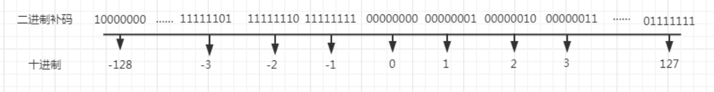
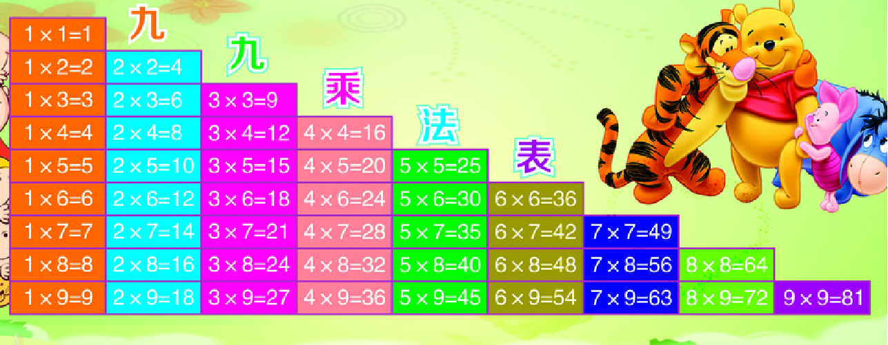
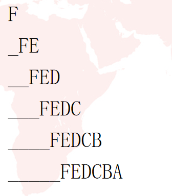

# 复习

```c
#include <stdio.h> //输入和输出的头文件
#include <stdlib.h> //库函数的头文件
#include <string.h> //字符函数的头文件

int fun()
{
	return 0; //返回main函数
}

int main(void)
{
	//注释信息
	printf("hello world\n");

/*
	printf("hello world\n");
	printf("hello world\n");
	printf("hello world\n");
*/

#if 0
	printf("hello world\n");
	printf("hello world\n");
	printf("hello world\n");
#endif

	return 0; //结束程序
}


使用vim编辑器

1. 按i插入模式 (写代码)

	o
	a

2. 
vim 01.c
按esc退出插入模式，进入命令行模式

nyy

ndd

p

u

ctrl + r 

选中区域，按=缩进

gg=G

gg

G


3. 底行模式 shift + : 

w

q

wq

x

q!

:行数


/字符串的名字
n
N


替换：
：%s/旧/新/g 
：s/旧/新/g 


常量 
	100 200
	3.14  2.56 
	'a'  'b' '1' 
 	"hello"
 	#define N 2
 
变量
	int a;
	int b;
	a = 10;
	a = b;
	a = 10 + b;
	printf("%d  %d\n", a, b);

	float a;
	float b;
	a = 3.14;
	a = b;
	a = 2.56 + b;
	printf("%f  %f\n", a, b);

	char a;
	char b;
	a = 'a';
	b = 'B';
	a = b;
	a = 32 + b;
	printf("%c  %c\n", a, b);	

	#include <stdbool.h>

	bool a;  //非零即真
	
	a = 6; //真
	a = -6; //真
	a = 0; //假
	a = true; //真
	a = false; //假


signed char a = -31;  //有符号

取值范围：-2^7 ~ 2^7-1 (-128-127)

unsigned char a = 97; //无符号

取值范围： 0~2^8-1 (0-255)


数据类型转换
{
	隐式转换{
		1. 小类型-->大类型 int --> float
		2. 有符号-->无符号 
	}

	强制转换 : 大类型-->小类型
	float a = 3.14;
	
	int b = (int)a;

	printf("%d\n", b); //3
}

//字符串

sizeof("hello"); //6bytes  '\0'
strlen("hello"); //5bytes   <string.h>

//输入和输出语句

int a = 100;
flaot b = 3.14;
char c = '1';

printf("%d %f %c %#x %u %o\n", 
	a, b, c, 0x32, 300, '\141' 
);

char *p = "hello";
printf("hello\n");
printf("%s\n", p);

int a;
flaot b;
char c;
int n = scanf("%d%f %c", &a, &b, &c);

10 3.14 a  // n=3
10 3.14 3.14  // n=2
10 a 3.14 //n=1

3.14 3.14 a // n = 0
```


# 作业


```c
转义字符： 
    
    '\n'   '\t'
    
    '\\'  --> 反斜杠
    
    '\''  --> 单引号
    
    '\"'  --> 双引号
    
    '\?'  --> 问号
    
    '\ddd'  --> 八进制 '\141' '\67'   注意：八进制0~7 
    
    '\xdd'  --> 十六进制

```


# 一，运算符，表达式，语句

## 1，运算符

### 1.1 赋值 

​		赋值运算符： =   ，从右向左赋值，例如： a = 10,  先取右边的10，然后找到左边a，将10赋给a

​		左值：在赋值号左边的数据，必须为变量，表示变量在内存中的空间

​		右值：在赋值号右边的数据，可以是：常量，变量，表达式，地址等，表示一个数值。

​	例如：

​		int a,b;

​		a = 120;

​		b = a;

​       a = b+3+a;


​	注意：左值不能为常量


### 1.2 算术运算

​		算术运算符：+ 	-	 *	 /	% 	++  --

注意以下几点：

​		%取余数运算，左右两边的数据必须为整型。

​		++和--表示数据自加1，或自减1 ，用法有两种：

第一种：++ 或 -- 在数据的右边，先取数据的值，参与运算，最后再自加或自减

例如： 

​	int a = 3,b;      b =  a++ *  5;     //先取a的值，乘以5，把结果赋给b，最后a自加1

第二种：++ 或 -- 在数据的左边，先自加或自减1，然后取数据的值，参与运算

例如： 

​	int a = 3,b;      b =  ++a  *  5;     //先对a自加1，然后取出a的值乘以5，把结果赋给b


例如：

```c
int a=0, b = 1;  
(a++ && b++)? a++:++b;         
printf("%d %d\n", a, b);
```


### 1.3 逻辑运算

逻辑运算符：！		&&		||		，表示真假运算

逻辑与真值表：

​				表达式1    &&   表达式2    =   结果

​				------------------------------------------------   

​				 真                         真                  真

​				 真                         假                  假

​				 假                         真                  假		

​				 假                         假                  假

​				//当表达式1为假，则结果为假，表达式2不会被计算机执行，这种规则称为：断路运算.

逻辑或真值表：

​				表达式1    ||   表达式2    =   结果

​				------------------------------------------------   

​				 真                         真                  真

​				 真                         假                  真

​				 假                         真                  真		

​				 假                         假                  假

​				//当表达式1为真，则结果为真，表达式2不会被计算机执行，这种规则称为：断路运算.	

### 1.4 关系运算

​	关系运算符： < 	<= 	 > 		 >= 		 ==		 !=    ，

​	

​	条件判断结果只有两种情况：真(非0为真)或者假(0)


​	注意： 

​			==      //关系运算，表示两个数是否相等

​			=       //赋值运算，表示将右值赋给左值

​	例如：

​		int a = 4,b = 5;

​		a == b;          //结果为0

​		a  = b;          //结果为5


### 1.5 位运算

位运算符：~		&		|		^		<<		>>  ，表示按数据的二进制位进行逻辑运算


二进制取反：~  

​	1->0     0->1


- 计算机中数据的存储是以补码形式存放的

- 正数的补码跟原码相同

- 负数的补码是在原码的基础上先求反码，然后再 + 1

	

例如： 

```
char ch = 5;

~ch --> -6


&: 两边都为1才为1

|: 有1就为1 

^: 相同为0 ，不同为1

<< : 左移 高位移出部分舍弃，低位不够部分补0

>> : 右移 
{
	正数：低位移出部分舍弃，高位不够部分补0
	负数：低位移出部分舍弃，高位不够部分补1
}
```


注意： printf函数打印的值和变量的值不一定相同


**清零或者置1**

```c
单片机：对寄存器进行操作 32位

清零：&~
置一： |

对0xff的第5位清零：0xff & ~(0x1<<5)

对0xff的第5-7位清零：0xff & ~(0x7<<5)

对0x12的第2-3位置一：0x12 | (0x3<<2)

```


### 1.6 复合运算

​	复合运算：将赋值运算和算术，位运算结合起来，比如： +=  -=  *=   /=    %=   &=  |=   <<=   >>=

例如： 

​	int a = 5,b = 3;

​	a =  a + b;     ---->  a += b;

   a  =  a<<2;     ----> a <<= 2; 


### 1.7 条件运算

条件运算符为三目运算符，

格式：    表达式1  ？ 表达式2 ： 表达式3       //如果表达式1 为真，则结果取表达式的值，否则，结果取表达式3的值

例如：

​		int a = 5,b = 3;    

​        a > b ? a : b      --------->  结果为5

​		a < b ? a : b    --------> 结果为3


### 1.8 逗号运算

​	逗号运算符： ，         ，从左到右运算，运算结果取最右边的表达式的值

​    例如： 

​	 int a = 5,b = 3,c;

​	 a += 4, b = a + 10, c = a+b       ---------->运算结果为： 28


### 1.9 sizeof运算

​	sizeof运算符 ： 计算数据占用内存的大小，或者数据类型的长度。

​    sizeof(int)   -------//计算int类型的长度

​    int  a ;     sizeof(a)  --------- //计算变量a占用内存的大小

例如： 

```
sizeof("hello"); //6  字符串占内存的大小

sizeof(int);  //4

int a;
sizeof(a);  //4


```


## 2，表达式

所谓表达式就是指由运算符、运算量和标点符号组成的有效 序列，其目的是用来说明(描述)一个计算过程。例如： 

1 

i+100 

x = ++q%3 

C的一个重要的属性是每一个C表达式都有一个值。为了得到 这个值，你可以按照运算符优先级描述的顺序来完成运算。 

下面是一些表达式和它们的值。 

**表达式** 																	**值** 

-4+6 																		2 

c=3+8 																	11 

5>3 																		1 

6+(c=3+8) 															17


## 3，语句

语句是由表达式+ ；组成。 

表达式可以独立形成语句，称为表达式语句。

大多数语句由表达式构造而成，在表达式的后面加一个分号标识就构成语句。

一个语句是一条完整的计算机指令，在C程序中，计算机以语句为单位一条一条执行的，例如： 

const = 1 //这是一个赋值表达式 

const = 1; //这是一个赋值语句(表达式语句)


# 二，控制流语句

控制流语句 ：  用于控制计算机执行程序的逻辑顺序的一些特殊的语句。

分为三大类：

## 1.分支控制流语句

分支控制流语句：根据条件决定是否要执行语句块，分为三种：

### 1.1	if语句

格式：

if(表达式){		//表达式为真，执行代码块，否则不执行代码块

​	代码块

}

例如： 

```c


```


### 1.2	if-else语句

格式：

if(表达式1){		//表达式1为真，执行代码块1，否则判断表达式2

​	代码块1

}else if(表达式2){  //表达式2为真，执行代码块2，否则执行代码块3

​	代码块2

}else{

​	代码块3

}

例如： 

```


```


### 1.3	switch语句

格式：

switch(表达式){						//表达式为整型的运算结果

​	case 整型常量1：

​				代码块1; break;

​	case 整型常量2：

​				代码块2;break;

​	..........

​	case 整型常量n：

​				代码块n;break;

​	default:								//default可以写，也可以不写

​			    代码块n;  break;

}

执行逻辑：


例如： 

```


```


## 2.循环控制流语句 

循环控制流语句：控制程序中某些代码重复的执行

分三种：

### 2.1 while语句

格式：

while(表达式) //表达式：控制循环的次数，表达式如果为真，就执行一次循环体，否则，不执行，直接执行while后面的语句

{      

​			语句1；

​			语句2；

​			语句3；	

}

​	先判断表达式，然后执行循环体

例如： 	

```c


```


### 2.2 do-while语句

格式： 

​		do{

​			语句1；

​			语句2；

​			语句3；	

​		}while(表达式);

​		先执行循环体，然后在判断表达式，如果表达式为真，则继续执行一次循环体，否则，结束循环，执行后面的语句

例如： 	

```c


```

### 2.3 for语句

格式： 

​	for(表达式1 ; 表达式2 ; 表达式3) {     //三个表达式可以省略，但是两个分号不能省略，必须要写

​			要循环的语句块

​	}

  执行逻辑： 


例如： 

```c


```


循环语句之间可以相互嵌套，嵌套-循环中可以再写循环

例如： 

```


```


例如：




例如：




## 3.跳转控制流语句

跳转控制流语句：控制计算机跳到某个特定位置执行程序，分三种：

### 3.1 continue语句

​	只能用于循环语句中，表示跳出一次循环体的执行。

​	例如： 

```


```

### 3.2 break语句

​	1》可以用于循环语句中，表示跳出一层循环

​	例如： 

```


```

​		

​	2》也可以用在switch语句中，表示跳出switch语句

​	例如： 

```


```


### 3.3 goto语句

​	无条件跳转，可以在函数中随意跳转

例如： 

```


```


# 三，函数

## 1，概念

​	函数：对一段具有某个特殊功能的代码的封装。

   封装的作用：

​	1》避免写重复的代码

​	2》使程序模块化

​	3》有利于程序的维护和升级

## 2，函数中的基本概念

### 2.1 函数的定义(函数的实现)

格式： 

​	返回值类型  函数名(参数列表)			//函数头

​	{															 //函数体

​			要封装的代码块

​	}

​	返回值类型：

​			如果函数需要返回数据，则要通过函数返回值类型指定数据的类型。

​			如果函数不需要返回数据，则返回值类型用viod表示

​	参数列表：

​			如果函数需要传递参数，才能执行，则需要在参数列表中定义每一个参数

​			如果函数不需要传递参数，则参数列表用void表示

例如： 

​		void fun1(int a){					//有参数，没有返回值

​					printf("a  = %d\n",a);

​		}

​		 int fun2(void){				//没有参数，有返回值

​				return  100;

​		}

​		void fun3(void)			//没有参数，也没有返回值

​		{

​				printf("hello world\n");

​		}

​		int fun4(int a,int b){		//有参数，也有返回值

​				return  a + b;

​		}


### 2.2 函数的调用(函数的使用)

​	格式：

​			函数名()						//没有参数

或		

​			函数名(参数列表)        //有参数


### 2.3 函数的声明

格式：  函数头 + ；

例如： 

​		void fun3(void)			//没有参数，也没有返回值

​		{

​				printf("hello world\n");

​		}

声明上面的函数： void fun3(void)；

例如：

```


```


## 3，函数的传参

### 3.1  几个相关的概念

​	1》形参

​			在函数头中定义的参数，称为形式参数，简称形参。

​			形参必须是变量

​			定义形参时，不需要初始化，在调用函数时，会通过实参给形参初始化

​	2》实参

​			在函数调用语句中传递的参数，称为实际参数，简称实参。

​			实参可以是变量，常量，表达式，地址(指针)


### 3.2 传参方式

​	1》值传递 (特点)

​				形参和实参数据类型相同

​				在被调用的函数中，不能给实参赋值(不能修改实参)

​	2》地址传递(特点)

​				形参类型为实参类型对应的指针类型

​				在被调用函数中，可以给实参赋值(可以修改实参)

例如：

```


```


## 4，全局变量

### 4.1概念

​	在所有函数外面定义的变量 称为全局变量。

​    把全局变量以外的变量称为局部变量。

​	例如： 

```


```


### 4.2全局变量的使用 

​	1》全局变量在多个函数中都可以被使用

```


```

​	2》如果函数中定义了与全局变量同名的局部变量，则在该函数中不能再使用这个同名的全局变量

```


```

