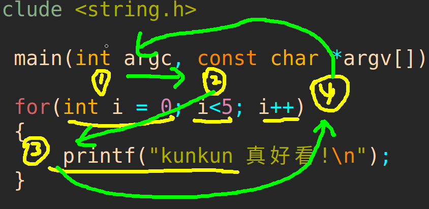

# 复习

```c
int a, b;
a = 1;
a = b;
a = b + 10 +2;

注意： = 左边不能是常量

+ - * / % ++ --

a += b; // a = a+b;
a -= b; // a = a-b;
a *= b; // a = a-b;
a /= b; // a = a-b;
a %= b; // a = a-b;

int a = 10;

printf("%d\n", a++); //先运算，再加1
printf("%d\n", ++a); //立刻加1

printf("%d\n", a--); //先运算，再减1
printf("%d\n", --a); //立刻减1

&& : 两边条件同时满足，都为真才为真

|| ： 满足任意一边为真就为真

！： 真-->假  假-->真

注意： 断路法则 
		&& 左边为假，没必要看右边
		|| 左边为真，没必要看右边
		
int a = 1, b =2;
if( ! a>b)
{


}

> < >= <= == !=

int a = 1, b =2;
if( a != b ) //真
{

}

位运算（二进制）： ~ & | ^ << >>

补码： ~原码+1
原码： ~补码+1

~5 --> -6

 0 0 0 0 0 1 0 1
 1 1 1 1 1 0 1 0  补码
取反：1 0 0 0 0 1 0 1 
+ 1: 1 0 0 0 0 1 1 0 ----> -6


十进制：10个手指  0~9
二进制：高低电平  01

方案一： 2
0 0 0 0 0 0 1 0

怎么表示负数？

方案二： BYTE最高位 0 ：正数 1  ：负数

2  ---> 0 0 0 0 0 0 1 0
-2 ---> 1 0 0 0 0 0 1 0

2 + (-2) ---> 1 0 0 0 0 1 0 0 (-4)

原码表示法

方案三：

1  : 0 0 0 0 0 0 0 1 
-1 : 1 1 1 1 1 1 1 1

1 + ? = 0

2  : 0 0 0 0 0 0 1 0 
-2 : 1 1 1 1 1 1 1 0

3  : 0 0 0 0 0 0 1 1
-3 : 1 1 1 1 1 1 0 1

补码： 负数的绝对值，取反，+1

-5

0 0 0 0 0 1 0 1
反码：1 1 1 1 1 0 1 0
补码：1 1 1 1 1 0 1 1

signed char (有符号)

取值范围： -128 ~ 127

unsigned char (无符号)

取值范围： 0~255


signed short (有符号)

取值范围：-2^15 ~ 2^15-1

unsigned short (无符号)

取值范围：0 ~ 2^16-1


signed int (有符号)

取值范围：-2^31 ~ 2^31-1

unsigned int (无符号)

取值范围：0 ~ 2^32-1


&: 都为1才为1

| ：有1就为1

^ : 相同为0 ，不同为1

int x = 10, y =12;

(交换)
x ^= y;
y ^= x;
x ^= y;

【正数 <<    >>】
0x23 << 2  --> 0x8c
0x23 >> 2  --> 0x8 


【负数  <<   >>】

-5: 补码  （负数的绝对值，取反， 加一）

1 1 1 1 1 0 1 1  << 2  (-20)
高位移出部分舍弃，低位不够补0

-20： 补码

1 1 1 0 1 1 0 0  >> 2 (-5)
低位移出部分舍弃，高位不够补1


三目运算符：
(表达式)?真：假

逗号运算符:从左到右，一次计算，只会输出最右边的表达式

int a = 2, b = 3, z;

z = ( a, b+2, a = b+2 , b = a+3)

a = 5
b = 8
z = 8

sizeof(int);  //1.求数据类型占内存的大小
sizeof(char);

char ch = '1';
sizeof(ch); //2.求变量占内存的大小

sizeof(char) == sizeof(ch) == 1Byte


a+b;

a+2;

int i = -1;
if(i) //括号当中的表达式：非零即真
	printf("if\n");
else
	printf("else\n");


if(age < 0 || age > 120)
{
	printf("不做人了\n");
}
else if(age >= 60)
{
	printf("注意身体!\n");
}
else if(age >= 18)
{
	printf("欢迎光临!\n");
}
else{
	printf("未成年禁止入内!\n");
}

int m;
scanf("%d", &m);
switch(m) //整型 、 字符型、 枚举
{
	case 10:
		printf("输入的数字是10\n");
		break;
	case 20:
		printf("输入的数字是20\n");
		break;
	case 30:
		printf("输入的数字是30\n");
		break;		
	case 40:
		printf("输入的数字是40\n");
		break;
	case 50:
		printf("输入的数字是50\n");
		break;
	case 60:
		printf("输入的数字是60\n");
		break;
    ...... 
    default: //另外的情况
    	printf("输错了!\n");
    	break;
}


```

# 二，控制流语句

控制流语句 ：  用于控制计算机执行程序的逻辑顺序的一些特殊的语句。

分为三大类：

## 1.分支控制流语句

分支控制流语句：根据条件决定是否要执行语句块，分为三种：

### 1.1	if语句

格式：

if(表达式){		//表达式为真，执行代码块，否则不执行代码块

​	代码块

}

例如： 

```c


```


### 1.2	if-else语句

格式：

if(表达式1){		//表达式1为真，执行代码块1，否则判断表达式2

​	代码块1

}else if(表达式2){  //表达式2为真，执行代码块2，否则执行代码块3

​	代码块2

}else{

​	代码块3

}

例如： 

```


```


### 1.3	switch语句

格式：

switch(表达式){						//表达式为整型的运算结果

​	case 整型常量1：

​				代码块1; break;

​	case 整型常量2：

​				代码块2;break;

​	..........

​	case 整型常量n：

​				代码块n;break;

​	default:								//default可以写，也可以不写

​			    代码块n;  break;

}

执行逻辑：


例如： 

```


```


## 2.循环控制流语句 

循环控制流语句：控制程序中某些代码重复的执行

分三种：

### 2.1 while语句

格式：

while(表达式) //表达式：控制循环的次数，表达式如果为真，就执行一次循环体，否则，不执行，直接执行while后面的语句

{      

​			语句1；

​			语句2；

​			语句3；	

}

​	先判断表达式，然后执行循环体

例如： 	

```c
三要素：

1. 初始化的变量
2. 循环条件
3. 自加或者自减的条件

int i = 0;    
while( i<10 )     
{
    
    i++;
}
//循环了几次？     
答案：外面while 11次
     里面的内容 10次 （主要关心）
    
int i = 1;
while(i<10)
{
    
    i++;
}
    

int i = 10;
while(i>=0)
{
 
    i--;
}
 


```


### 2.2 do-while语句

格式： 

​		do{

​			语句1；

​			语句2；

​			语句3；	

​		}while(表达式);

​		先执行循环体，然后在判断表达式，如果表达式为真，则继续执行一次循环体，否则，结束循环，执行后面的语句

例如： 	

```c


```

### 2.3 for语句

格式： 

​	for(表达式1 ; 表达式2 ; 表达式3) {     //三个表达式可以省略，但是两个分号不能省略，必须要写

​			要循环的语句块

​	}

  执行逻辑： 




例如： 

```c

for(int i=0; i<10; i++)
{
  //循环了10次   
}

int i;
for(i=0; i<10; i++)
{
    
}


```


循环语句之间可以相互嵌套，嵌套-循环中可以再写循环

例如： 

```
套娃


```


例如：


例如：

```
F
_FE
__FED
___FEDC
____FEDCB
_____FEDCBA
```


## 3.跳转控制流语句

跳转控制流语句：控制计算机跳到某个特定位置执行程序，分三种：

### 3.1 continue语句

​	只能用于循环语句中，表示跳出一次循环体的执行。

​	例如： 

```


表示跳出本次循环


```

### 3.2 break语句

​	1》可以用于循环语句中，表示跳出一层循环

​	例如： 

```


表示跳出本层循环


```

​		

​	2》也可以用在switch语句中，表示跳出switch语句

​	例如： 

```

```


### 3.3 goto语句

​	无条件跳转，可以在函数中随意跳转

例如： 

```


```


# 三，函数

## 1，概念

​	函数：对一段具有某个特殊功能的代码的封装。

   封装的作用：

​	1》避免写重复的代码

​	2》使程序模块化

​	3》有利于程序的维护和升级

## 2，函数中的基本概念

### 2.1 函数的定义(函数的实现)

格式： 

​	返回值类型  函数名(参数列表)			//函数头

​	{															 //函数体

​			要封装的代码块

​	}

​	返回值类型：

​			如果函数需要返回数据，则要通过函数返回值类型指定数据的类型。

​			如果函数不需要返回数据，则返回值类型用viod表示

​	参数列表：

​			如果函数需要传递参数，才能执行，则需要在参数列表中定义每一个参数

​			如果函数不需要传递参数，则参数列表用void表示

例如： 

​		void fun1(int a){					//有参数，没有返回值

​					printf("a  = %d\n",a);

​		}

​		 int fun2(void){				//没有参数，有返回值

​				return  100;

​		}

​		void fun3(void)			//没有参数，也没有返回值

​		{

​				printf("hello world\n");

​		}

​		int fun4(int a,int b){		//有参数，也有返回值

​				return  a + b;

​		}


### 2.2 函数的调用(函数的使用)

​	格式：

​			函数名()；						//没有参数

或		

​			函数名(参数列表) ；       //有参数


### 2.3 函数的声明

格式：  函数头 + ；

例如： 

​		void fun3(void)			//没有参数，也没有返回值

​		{

​				printf("hello world\n");

​		}

声明上面的函数： void fun3(void)；

例如：

```

```


## 3，函数的传参

### 3.1  几个相关的概念

​	1》形参

​			在函数头中定义的参数，称为形式参数，简称形参。

​			形参必须是变量

​			定义形参时，不需要初始化，在调用函数时，会通过实参给形参初始化

​	2》实参

​			在函数调用语句中传递的参数，称为实际参数，简称实参。

​			实参可以是变量，常量，表达式，地址(指针)


### 3.2 传参方式

​	1》值传递 (特点)

​				形参和实参数据类型相同

​				在被调用的函数中，不能给实参赋值(不能修改实参)

​	2》地址传递(特点)

​				形参类型为实参类型对应的指针类型

​				在被调用函数中，可以给实参赋值(可以修改实参)

例如：

```


```


### 3.3 函数封装

```

1. 主函数 --- 函数调用  main.c
2. 子函数 --- 函数方法  fun.c
3. 头文件 --- 函数声明  fun.h

```


## 4，全局变量

### 4.1概念

​	在所有函数外面定义的变量 称为全局变量。

​    把全局变量以外的变量称为局部变量。

​	例如： 

```


```


### 4.2全局变量的使用 

​	1》全局变量在多个函数中都可以被使用

```


```

​	2》如果函数中定义了与全局变量同名的局部变量，则在该函数中不能再使用这个同名的全局变量

```


```

