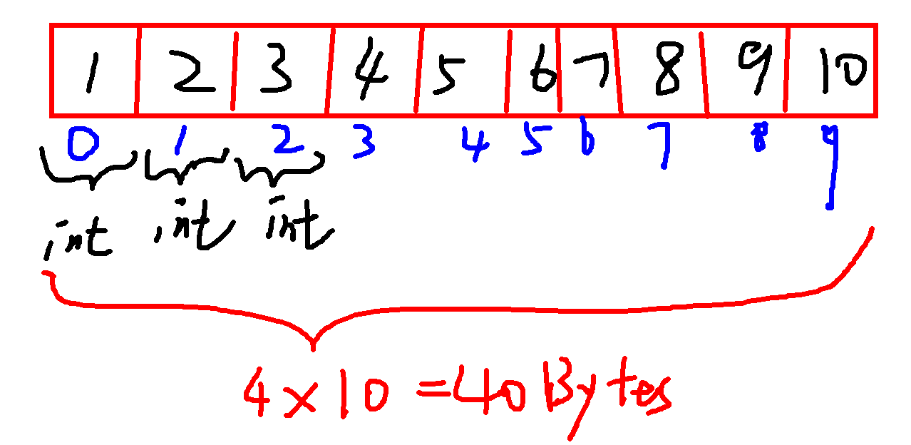
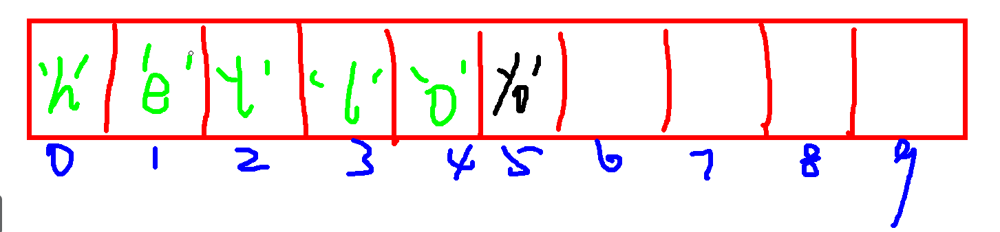

# 复习

```c

if(表达式) //判断表达式是否为真   非零即真
{


}

int i = -1;
if(i) //真
	printf("if\n");


if(age >= 18)
{
	printf("欢迎光临!\n");
}
else{  //另外的情况 age<18
	printf("禁止入内!\n");
}

int age;
scanf("%d", &age);

if(age <= 0 || age > 120)
{
	printf("input wrong!\n");
}
else if(age >= 60)
{
	printf("too old\n");
}
else if(age >=18 )
{
	printf("very good!\n");
}
else{
	printf("go\n");
}

int age;
scanf("%d", &age);

switch(age/9)
{
 	case 0:
 	case 1:
 		printf("未成年 0~17 \n");
		break;
	case 2:
    case 3:
    case 4:
    ......
}


char ch;
scanf("%d", &ch);

switch(ch)
{
	case 'a':
		.....;
		break;
	case 'b':
		.....;
		break;
	......
	
	default:
		.....;
		break;
}


int i = 0;
while(i<10)
{

	i++;
}

int i = 10;
while(i>0)
{

	i--;
}


int i = 0;
do{
	//先执行一次
	i++;
}while(i<5);


for(int i = 0; i<10; i++)
{

}

for(int i = 10; i>0; i--)
{

}

在循环中再写循环

for(int i = 0; i<3; i++)
{
	for(int j=0; j<4; j++)
	{
		printf("%d %d\n", i, j);
	}
	
	for()
	{
	
	}
	
	int k=0;
	while()
	{
	
	}
	
}

i=0, j=0;
i=0, j=1;
i=0, j=2;
i=0, j=3;

i=1, j=0;
i=1, j=1;
i=1, j=2;
i=1, j=3;

i=2, j=0;
i=2, j=1;
i=2, j=2;
i=2, j=3;


双重for循环可以打印出很多的图形


continue 跳出本次循环

if(i % 2 == 1)
{
	continue; 
}

break
1. switch 跳出switch语句
2. 跳出本层循环

for()
{
	for()
	{
		for()
		{
			for()
            {
            	break;
            }
		}
	
	}
}

goto

	printf("1111\n");
	printf("2222\n");
    printf("3333\n");
    printf("4444\n");
	goto xxx;
    printf("5555\n");
xxx:


函数

形式：
	返回值 函数名(参数)
	{
	
	
	}

	void fun1(void)
	{
		printf("hello\n");
	}
	
	函数调用: fun1();

	void fun2(int a, int b)
	{
		printf("%d\n", a+b);
	}

	函数调用: fun2(1,2);
	
			int a = 1, b =2; fun2(a, b);

	int fun3(int a, int b)
	{
		return a-b;
	}

函数声明：花括号前面的部分加分号（函数头+分号）
void fun1(void);		
void fun2(int a, int b);
int fun3(int a, int b);

函数传参：

实参：函数调用的参数
形参：函数头的参数

值传递 （√）
地址传递: 能够改变实参的值

	void fun4(int a, int b)
	{
		a ^= b;
		b ^= a;
		a ^= b;
		
		printf("%d %d\n", a ,b);
	}
	
	int x = 1, y = 2;
	fun4(x, y);
	printf("%d %d\n", x ,y);
	
	
	void fun4(int *a, int *b)
	{
		*a ^= *b;
		*b ^= *a;
		*a ^= *b;
		
		printf("%d %d\n", *a , *b);
	}
	
	int x = 1, y = 2;
	fun4(&x, &y);
	printf("%d %d\n", x ,y);	
	
	
函数封装：	
	1. 函数调用 main.c
	2. 函数方法 fun.c
	3. 函数声明 fun.h
	
	
	
```


# 作业


# 全局变量

## 1 概念

​	在所有函数外面定义的变量 称为全局变量。

​    把全局变量以外的变量称为局部变量。

​	例如： 

```


```


## 2 全局变量的使用 

​	1》全局变量在多个函数中都可以被使用

```


```

​	2》如果函数中定义了与全局变量同名的局部变量，则在该函数中不能再使用这个同名的全局变量

```


```


# 内存地址

```c
电脑有物理的内存条

2G、4G、8G、16G。。。经过操作系统的映射出一个很大的一维数组（虚拟内存）

32bits --> 4G

64bits --> 48bits --> 256G

128G-->内核区域
128G-->用户区域

系统会为每一个数据单元分配一个6字节的编号，这个编号就叫内存地址

每个数据单元都是1个字节

```


# 一，数组

## 1 、数组的概念和分类

### 1.1 什么叫数组

​		具有相同类型的一组数据的集合称为数组。通常把这一组数据称为数组的元素。

​		数组在内存中的存储空间一定是连续的。


​		用户自定义的一种数据类型，在内存中连续开辟相同数据类型的空间


### 1.2 分类 

​		在c语言中，数组分为三类：

​		一维数组：具有相同类型的变量的集合称为一维数组。这些变量称为数组的元素。

​		多维数组：具有相同类型的数组的集合称为多维数组。

​		变长数组：在定义数组时，元素个数通过变量来指定，这样的数组称为变长数组。


## 2、一维数组

### 2.1 一维数组定义格式 

​		元素类型  数组名[元素个数];

​		

​	为何要使用一维数组：	

```
有很多个int ，很多char类型的数据

数组：
	int a[10];
	char buf[10];

```

### 2.2 一维数组初始化

​	1》完全初始化 -----//给数组中每一个元素赋值

​		例如： 

​			int  a[5] = {1,2,3,4,5};

​			int  a[ ] = {1,2,3,4,5};       //元素个数可以省略

​	   //对于字符型数组：

​		  char str[6] = {'h','e','l','l','l','\0'};

 		 char str[6] = {"hello"};

​		  char str[6] = "hello";		//字符数组初始化的简写形式 ---常用方式

​		  char str[ ] = "hello";		//完全初始化，元素个数可以省略 ---常用方式

​	2》部分初始化 -----//给数组前若干元素赋值

​		 int  a[5] = {1,2,3}; 

​		  //对于字符数组：

​		char str[10] = "hello"     //给字符数组部分初始化 ----常用方式

​	3》指定元素初始化  ------//给数组中某些元素赋值

​		int a[5] = {[2] =10,20,[1]=9};   		


### 2.3 一维数组赋值

1》只能单独给每一个元素赋值
2》一般通过循环语句赋值

例如： 

```


```

### 2.4 一维数组打印

非字符数组：循环方式打印每一个元素

字符数组：用%s直接打印

例如： 

```


```

### 2.5 一维数组存储结构

 **int a[10] = {1,2,3,4,5,6,7,8,9,10};**


**char buf[10] = "hello";**




### 2.6 常见的字符函数


**strlen**

**strcpy**

**strcat**

**strcmp**


## 3、多维数组

### 3.1 多维数组的定义格式

​	二维数组 ： 一维数组集合   一维数组元素数据类型 数组名[二维数组元素个数] [一 维数组元素个数] ；

​	三维数组：二维数组集合	一维数组元素数据类型 数组名[三维数组元素个数] [二维数组元素个数] [一 维数组元素个数] ；

​	.......

   n维数组： n-1维数组集合  一维数组元素数据类型 数组名[n维数组元素个数]...[二维数组元素个数] [一 维数组元素个数] ；

 例如： 

​	二维数组：  int  a[2] [3];          //a为二维数组，a的元素为a[0]和a[1],分别是两个一维数组，a[0]有三个元素，分别是:a[0] [0],a[0] [1],a[0] [2]    a[1]有三个元素，分别是:a[1] [0],a[1] [1],a[1] [2] 

​	三维数组： int b[2] [3] [4];     //b为三维数组，元素分别为b[0]和b[1] ,    b[0]有三个元素：b[0] [0],b[0] [1],b[0] [2] ，b[1]也有三个元素：b[1] [0],b[1] [1],b[1] [2]  , b[0] [0]为一维数组，有4个元素，分别是:b[0] [0] [0] ，b[0] [0] [1]，  b[0] [0] [2]， b[0] [0] [3]

//综上可知，多维数组为数组的集合，在多维数组中，二维数组用的比较多，其他更高维数组几乎不用，所以，下面以二维数组为例介绍。


### 3.2 二维数组初始化 

​	1》完全初始化 

​			int  a[2] [3]  = {{1,2,3}，{4,5,6}}；

​			int  a[ ] [3]  = {{1,2,3}，{4,5,6}}；   //数组a的元素个数可以省略

​	2》部分初始化 

​			int  b[3] [4] = {{1,2},{3,4}};

​	3》指定元素初始化 

​			int   b[3] [4] = {[2] = {[1] = 1,[3] = 2},{3,4}};


### 3.3 二维数组赋值

​		与一维数组类似，二维数组也不能整体赋值，只能分别给每一个元素赋值，例如： 

​		int a[2] [3];

​		int i,j;

​		for( i = 0; i < 2; i++)         //二维数组用两层循环方式赋值

​			for(j = 0; j < 3 ;j ++)

​				a[i] [j] = i+j+1;


### 3.4 二维数组打印

​	只能分别打印每一个元素的值，例如： 

```


```

### 3.5 二维数组存储类型


## 4、变长数组

变长数组：在定义数组时，元素个数通过变量来指定，这样的数组称为变长数组。

例如：

​		int n,m;

​		n = 5;

​		int  a[n];         //a为变长数组

​		n = 2;  m = 3;

​		int  b[n] [m];     //b为变长数组

例如： 

```


```

总结：

​	1》变长数组不能初始化

​	2》在定义变长数组时，变量的值必须确定，且大于0

​	3》不能把变长数组定义为全局的。


# 二，指针


前置知识点：

&：取地址符    （取出变量的地址）

*：指针运算符 （取出地址中的值）

指针变量：保存地址的变量


## 1、 指针的概念

把专门用于保存内存地址(内存地址应该在程序中有实际含义的)的变量称为指针变量，简称指针。


## 2，指针的定义 

​	定义格式：  (指针指向的)地址空间中的数据类型  * 指针名;

​	例如： 

​			int  *p1;       //p1中只能保存int的数据地址，int a;   p1 = &a;

​		    short  *p2;   //p2中只能保存short的数据地址，short b; p2 = &b;


## 3、指针的基本用法

例如： 

​	int  a = 120;

​    int* p = &a;        //等价于：int * p;  p = &a;

将某个数据的地址保存到指针中，通常称为指针指向该数据。

当指针指向某个数据时，对于指针来说，有三个表达式：

*p    ------- 表示指针指向的数据

p    ------ 表示指针本身

&p  ----- 表示指针的地址

```


```


## 4、指针运算

 		int i=1, j=2, *pi, *pj; 


### 4.1  赋值(assignment)：=

​		pi = &i; 

​		pj = &j; 

​		左值和右值类型必须要一致，对于指针：左值是指针变量，右值必须时指针指向的数据的地址。


### 4.2  取值(dereferencing)：*

​		i = *pj;          // *p表示取指针p指向的数据


###  4.3 取地址：&

​		&p; 					//&p 表示指针在内存空间中的地址。


### 4.4  加法：

​	注意：指针只能加一个整数，加法的运算结果与指针的类型有关。

​	例如： 

```


```

 总结：

​	指针加整数n表示指针向高地址方向偏移（n*指针指向的数据类型长度）的字节数。


###  4.5 减法：

​	1》指针可以减一个整数	

​	p-1; 

​	p--;

​	总结：指针加整数n表示指针向低地址方向偏移（n*指针指向的数据类型长度）的字节数。


​	2》同类型指针也可以相减

​	pi – pj; 		//表示pi中的地址到pj中的地址之间有多少个指针指向的数据空间大小 

 例如：

```


```


###  4.6 比较：

​		注意：必须时同类型的指针，才能比较大小。

​	if(pi > pj)   ------  //表示两个指针中的地址的高低比较


## 5、数组与指针的关系

### 5.1   数组名的含义

​		当我们定义一个数组时，计算机会给数组在内存中分配空间

​		此时数组名a：

​		1》代表数组在内存中的空间名称

​		2》代表数组的第一个元素a[0]的地址		

```

一维数组


```

```


二维数据


```

总结：

​		数组的元素可以有多种表示方式，a[i] 等价于 *(a+i)   ,这样的等价表达式，对于指针也适用。


### 5.2  用指针表示数组的元素

#### 1.数组指针和指针数组 

​	 数组指针：指向数组的指针，

​	例如：int (*p)[10];     

​		 p为数值指针

​		int ----表示p指向的数组元素类型为int 

​		10  ---- 表示p指向的数组有10个元素

​		p可以保存数组int a[10]的地址

​		例如：p = &a; 

 	指针数组：包含指针的数组，数组的元素为指针类型

​		例如：int *p[10]; 

​		p为数组名，该数组有10个元素，没有元素的类型为 int*


####  2.函数指针和指针函数 

 	函数指针：指向函数的指针，

​	 在c语言中，每个函数都有一个入口地址，用函数名表示，比如: fun, 也可以用函数名取地址表示，比如：&fun

​	通常，也可以将函数的入口地址保存到函数指针变量中，然后通过指针变量间接调用函数。

 例如：	int (*p)(int);     //定义一个函数指针

​			      |			 |

函数返回值类型   函数的参数类型

上面定义的函数指针只能指向有一个int参数，返回值为int的函数，例如： 

int fun01(int a)							void fun02(int a)                  int fun03(void)

{													{												{

​	..........										...........										............

}													}												}

p = fun01;       //正确				p = fun02;   //错误 				  p = fun03 ;      //错误


 指针函数：返回指针的函数，

​	例如：

​		char * p(int a)

​		{

​			char  *p =  "hello world";

​			return p;         //返回值为地址，这样的函数称为指针函数

​		} 

 

#### 3.函数指针数组 

 	由函数指针构成的数组，数组元素类型为函数指针的数组 

​	例如：int (*p[10])(int); 

​	p为数组名

  10 ----- 表示数组p中有10个元素

  int (*)(int) ; --------表示数组的每个元素类型为函数指针，指向有返回值类型为int，且只有一个int参数的函数。

​	

