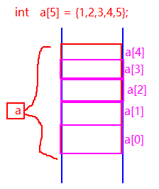
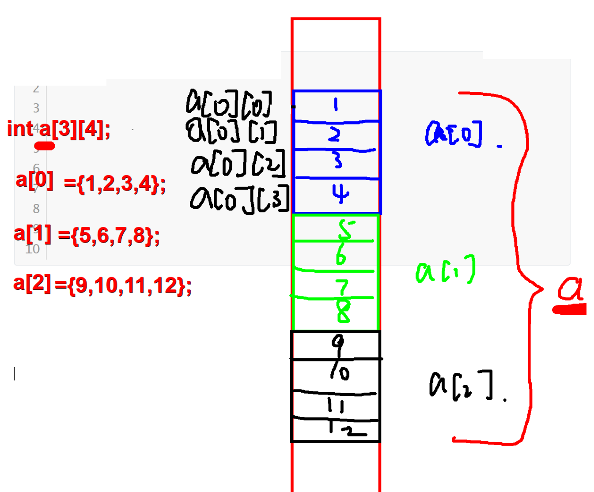

# 复习

```
数组：用户自定义一种数据类型

用来描述很多个相同数据类型的情况

char float int ......

一维整型数组：

int a[10] = {1,2,3,4,5,6,7,8,9,10};
int a[10] = {1,2,3,4,5};
int a[] = {1,2,3};

sizeof(a) = 10*4 = 40bytes

sizeof(int) = 4bytes

sizeof(char) = 1byte

下标从0开始的

数组名+下标 访问数组元素
a[0] -->1
a[1] -->2
a[9] -->10


int a[10] = {0};

赋值操作：
int i;
for(i=0; i<10; i++)
{
	scanf("%d", &a[i]);
}

打印操作:
for(i=0; i<10; i++)
{
	printf("%d ", a[i]);
}


一维字符数组：

char buf[10] = {"hello"};
char buf[10] = "hello";
char buf[10] = {'h','e','l','\0', 'l','o'};
puts(buf); //hel

sizeof(buf) = 10*1 = 10bytes //求数组buf占内存的大小

strlen(buf) = 5bytes; //求字符串的真实长度

hello'\0'  //字符串的末尾都会有一个'\0'作为结束标志

数组名+下标 访问数组元素

buf[0] --> 'h'
buf[1] --> 'e'
buf[8] --> '\0' == 0 == NULL

赋值操作：
int i;
for(i=0;i<10; i++)
{
	scanf("%c", &buf[i]);
}
输入 abvdefghij


gets(buf);  //警告 warning 

scanf("%s", buf); //输入一个字符串

fgets(buf, 10, stdin); //输入的字符串末尾有'\n'

buf[ strlen(buf)-1 ] = '\0';
	
	
打印操作：	
for(i=0;i<10; i++)
{
	scanf("%c", buf[i]);
}	

puts(buf);
	
printf("%s\n", buf);	
	

字符函数：
	
	int len = strlen(buf);
	
	strcpy( buf , "hhhh" ); //替换
	
	strcat(buf, "xxx");  //xxx拼接到前面字符串的末尾
	
	char buf[10] = "abcd";
	int n = strcmp(buf, "abcd"); 
	n == 0   //两个字符串相等
	
	char buf[10] = "abcd";
	int n = strcmp(buf, "Abcd"); 
	n == 32  //大于 比较的是ascii值
    
    char buf[10] = "abcd";
	int n = strcmp(buf, "dbcd"); 
	n == -3  //小于 比较的是ascii值
	
	char buf[100] = "abcdef";
	char *p = strstr(buf, "bc"); //在buf中寻找"bc"的位置，返回它的地址
	printf("%s\n", p); //"bcdef"
	
	
多维数组：常用的是二维数组,由多个一维数组组成	
	
二维整型数组：

int a[3][4] = { 1,2,3,4,
				5，6,7,8,
				9,10,11,12 };
第一个中括号：一维数组的个数  ---- 行数
第二个中括号：一维数组中元素的个数 ----列数
a是数组名，是一个地址常量，是一个行指针

int a[][3] = {1,2,3,4,5,6,7,8,9};
行数是可以省略的，从列数可以推出行数，等于3
注意：列数不能省略


int a[3][4] = { {1,2,3,4},{5,6,7},{8,9}};
a[0] = {1,2,3,4};
a[1] = {5,6,7};
a[2] = {8,9};


数组名+下标 访问数组元素
a[0][0] --> 1
a[0][1] --> 2
a[0][2] --> 3
a[0][3] --> 4

a[1][0] --> 5
a[1][1] --> 6
a[1][2] --> 7
a[1][3] --> 8

a[2][0] --> 9
a[2][1] --> 10
a[2][2] --> 11
a[2][3] --> 12

赋值操作：
int i, j;
for(i=0; i<3; i++)  //行数
{
	for(j=0;j<4; j++) //列数
	{
		scanf("%d", &a[i][j]);
	}
}

打印操作：
for(i=0; i<3; i++)  //行数
{
	for(j=0;j<4; j++) //列数
	{
		printf("%d ", a[i][j]);
	}
	puts("");
}


二维字符数组：

char str[3][4] = {"abc", "def", "hij"};

char str[][4] = {'a','b','c','d','e','f','h','i','j'};

可以省略行数，不能省略列数，要注意的是一维字符数组，末尾有'\0',所以这里
3个字符为一组，总共3行

char str[3][4] = {"a", "b", "c"};

str[0] = "abc"
str[1] = "def"
str[2] = "hij"


变长数组：

#define n 10

int n;
scanf("%d", &n);

int a[n];  
//1.不能初始化
//2. n > 0
//3. 不能定义成全局数组


【指针】

保存地址的变量-->指针变量-->简称指针

指针就是地址

指针变量==指针==地址

int a = 100;
int *p = &a;  //& 取地址符: 取出变量的地址

*p = 100; //指针运算符（取值运算）：取出地址中的值


int a[10] = {1,2,3,4,5,6,7,8,9,10};
int *p = a;

*p = 1;
*a = 1;  //数组名就是数组的首地址

*(p+1) = 2;
*(a+1) = 2;

*(p+2) = 3;
*(a+2) = 3;

p    0x112233445566
p+1  0x11223344556a

a    0x112233445566
a+1  0x11223344556a

p++;  //p+1  指针变量
p--;  //p-1  指针变量

a++;  //不行，地址常量，不能自加
a--;  //不行，地址常量，不能自减

p += 2; //可以 
p -= 2; //可以

a += 2; //不行，不能做左值
a -= 2; //不行，不能做左值


int x = 0x11223344;

int *p =  &x;
short *q = (short *)&x;
char *k = (char *)&x;

*p = 0x11223344;
*q = 0x3344;
*k = 0x44;

k   : 0x112233445566
k+1 : 0x112233445567

q   : 0x112233445566
q+1 : 0x112233445568

指针是有粗细的

sizeof(p) = 8bytes
sizeof(q) = 8bytes
sizeof(k) = 8bytes

同类型的指针相减，得到的值就是两个指针相隔的空间的个数


int a[3][4] = {1,2,3,4,5,6,7,8,9,10,11,12};

int i,j;
for(i=0;i<3;i++)
{
	for(j=0;j<4;j++)
	{
		printf("%d %d %d %d ",a[i][j],  
							  (*(a+i))[j],
        					  *(a[i]+j),
                              *(*(a+i)+j) );
	}
	puts("");
}


```


# 作业


# 一，数组

## 1 、数组的概念和分类

### 1.1 什么叫数组

​		具有相同类型的一组数据的集合称为数组。通常把这一组数据称为数组的元素。

​		数组在内存中的存储空间一定是连续的。


​		用户自定义的一种数据类型，在内存中连续开辟相同数据类型的空间


### 1.2 分类 

​		在c语言中，数组分为三类：

​		一维数组：具有相同类型的变量的集合称为一维数组。这些变量称为数组的元素。

​		多维数组：具有相同类型的数组的集合称为多维数组。

​		变长数组：在定义数组时，元素个数通过变量来指定，这样的数组称为变长数组。


## 2、一维数组

### 2.1 一维数组定义格式 

格式：元素类型  数组名[元素个数];

​		

```
有很多个int ，很多char类型的数据

数组：
	int a[10];
	char buf[10];

```


### 2.2 一维数组初始化

​	1》完全初始化 -----//给数组中每一个元素赋值

​		例如： 

​			int  a[5] = {1,2,3,4,5};

​			int  a[ ] = {1,2,3,4,5};       //元素个数可以省略

​	   //对于字符型数组：

​		  char str[6] = {'h','e','l','l','l','\0'};

 		 char str[6] = {"hello"};

​		  char str[6] = "hello";		//字符数组初始化的简写形式 ---常用方式

​		  char str[ ] = "hello";		//完全初始化，元素个数可以省略 ---常用方式

​	2》部分初始化 -----//给数组前若干元素赋值

​		int  a[5] = {1,2,3}; 

​		 //对于字符数组：

​		char str[10] = "hello"     //给字符数组部分初始化 ----常用方式

​	3》缺省初始化: 编译器会根据用户初始化的元素个数，给数组开辟足够大的空间大小

​		int a[] = {1,2,3,4,5};
​		a[0] == 1;
​		a[4] == 5;		


### 2.3 一维数组赋值

1》只能单独给每一个元素赋值
2》一般通过循环语句赋值

例如： 

```

数组名+下标  --> 访问数组中的元素

int a[10] = {1,2,3,4,5};

printf("%d\n", a[0]); //数组的下标是从0开始  1

printf("%d\n", a[1]); //2

printf("%d\n", a[4]); //5

a[3] = 100;  //赋值

int i;
for(i=0; i<5; i++)
{
	scanf("%d", &a[i]);
}

```


### 2.4 一维数组打印

非字符数组：循环方式打印每一个元素

字符数组：用%s直接打印

例如： 

```


int a[10] = {0};

char buf[10] = "hello1234";

char buf[10] = {'h', 'e', 'l','l','o'};

char buf[10] = {"hello"};

char buf[10] = "hello"; //√

char buf[] = "hello";  //默认开6个空间,每个空间1Byte

printf("%s\n", buf); //数组名就是数组的首地址

puts(buf); //字符串的输出函数

gets(buf); //字符串的输入函数（不安全）

1. scanf("%s", buf);
2. fgets(buf, 10, stdin);
   buf[strlen(buf)-1] = '\0';  //去掉末尾的'\n'


```


### 2.5 一维数组存储结构(图)





### 2.6 常见的字符函数


```c
strlen:求字符串的真实长度

    char buf[10] = "heloox";
	
	strlen(buf) = 6; 	//不加'\0'
	sizeof(buf) = 10;   //数组占内存的大小 10*1byte = 10Bytes

strcpy
    
	char buf[20] = "xxx";
    
	char str[20] = "yy";
    
	strcpy(buf, str);  //参数必须是地址, buf str都是数组名，首地址
	
	buf --> "yy"
	str --> "yy"
        
    strcpy(buf, "wwwwwww");
	strcpy(str, "ttttttt");
     
	后面的字符串把前面的字符串给替换掉
        

strcat

	char buf[20] = "xxx";
    
	char str[20] = "yy";
    
	strcat(buf, str); 	
     
	buf --> "xxxyy"
    str --> "yy"    
    
    strcat(buf, "ooo");
	strcat(str, "lll");
	
	后面的字符串拼接到前面的字符串的末尾


strcmp
    
	char buf[20] = "xxx";
    
	char str[20] = "xxx";
    
	int n = strcmp(buf, str);  //比较的是ASCII值
    
	n == 0   等于
	n < 0	 小于
    n > 0    大于
    
    strcmp(buf, "tt");  //大于
        
```


## 3、多维数组

### 3.1 多维数组的定义格式

```c
二维数组 ： 一维数组集合   
	一维数组元素数据类型 数组名[二维数组元素个数] [一维数组元素个数] ；

三维数组：  二维数组集合	
	一维数组元素数据类型 数组名[三维数组元素个数] [二维数组元素个数] [一维数组元素个数] ；

.......

n维数组： n-1维数组集合  
    一维数组元素数据类型 数组名[n维数组元素个数]...[二维数组元素个数] [一维数组元素个数] ；

例如： 

二维数组：  int  a[2] [3];          
//a为二维数组，a的元素为a[0]和a[1],
//分别是两个一维数组
//a[0]有三个元素，分别是:a[0] [0],a[0] [1],a[0] [2]    
//a[1]有三个元素，分别是:a[1] [0],a[1] [1],a[1] [2] 

三维数组： int b[2] [3] [4];     
//b为三维数组，元素分别为b[0]和b[1] ,    
//b[0]有三个元素：b[0] [0], b[0] [1], b[0] [2] 
//b[1]有三个元素：b[1] [0], b[1] [1], b[1] [2]  
//其中b[0] [0]为一维数组，有4个元素，
//分别是: b[0] [0] [0] ，b[0] [0] [1]，  b[0] [0] [2]， b[0] [0] [3]

一般来说，多维数组为数组的集合，在多维数组中，二维数组用的比较多，其他更高维数组几乎不用，所以，下面以二维数组为例介绍。
```


### 3.2 二维数组初始化 

```c
一般形式：<数据类型> 数组名[行数][列数];

1》完全初始化 

int  a[2] [3]  = {{1,2,3}，{4,5,6}}；

int  a[ ] [3]  = {{1,2,3}，{4,5,6}}；   

2》部分初始化 

int  b[3] [4] = {{1,2},{3,4}};

```


### 3.3 二维数组赋值

```c
与一维数组类似，二维数组也不能整体赋值，只能分别给每一个元素赋值，例如： 

int a[2] [3];

int i,j;

for( i = 0; i < 2; i++)         //二维数组用两层循环方式赋值

	for(j = 0; j < 3 ;j ++)

		a[i] [j] = i+j+1;
```


### 3.4 二维数组打印

​	只能分别打印每一个元素的值，例如： 

```


```


### 3.5 二维数组存储(图)




## 4、变长数组

```c
定义：在定义数组时，元素个数通过变量来指定，这样的数组称为变长数组。

例如：

int n,m;

n = 5;

int  a[n];         //a为变长数组

n = 2;  m = 3;

int  b[n] [m];     //b也为变长数组
```

例如： 

```c


总结：

1》变长数组不能初始化

2》在定义变长数组时，变量的值必须确定，且大于0

3》不能把变长数组定义为全局的。
```


# 二，指针


```
前置知识点：

&：取地址符    （取出变量的地址）

*：指针运算符 （取出地址中的值）

指针变量：保存地址的变量


int a = 10;

&a --> 0x789

*(0x789) --> 10

*&a --> 10

* 和 &互为逆运算，互相抵消


int *p;  //说明p是一个指针变量
p = &a;

或者

int *p = &a;


```


## 1、指针的概念

把用来保存地址的变量称为指针变量，简称指针。


指针就是地址


指针变量 == 指针 == 地址


## 2，指针的定义 

定义格式：  (指针指向的)地址空间中的数据类型  * 指针名;


例如： 

​			int  *p1;       //p1中只能保存int的数据地址，int a;   p1 = &a;

​		    short  *p2;   //p2中只能保存short的数据地址，short b; p2 = &b;


## 3、指针的基本用法

例如： 

​	int  a = 120;

​    int *p = &a;        //等价于：int * p;  p = &a;

将某个数据的地址保存到指针中，通常称为指针指向该数据。

当指针指向某个数据时，对于指针来说，有三个表达式：

*p  --> 120   ------- 表示指针指向的数据

p    --> 0x789 ------ 表示指针本身

&p  地址的地址 ----- 表示指针的地址

```


```


## 4、指针运算

**-------int i=1, j=2, *pi, *pj; --------**


### 4.1  赋值

​		pi = &i; 

​		pj = &j; 

​		左值和右值类型必须要一致，对于指针：左值是指针变量，右值必须时指针指向的数据的地址。


### 4.2  取值

​		*pj;          // *p表示取指针p指向的数据


###  4.3 取地址

​		&p; 					//&p 表示指针在内存空间中的地址。


### 4.4  加法

​	注意：指针只能加一个整数，加法的运算结果与指针的类型有关。

​	例如： 

```


```

 总结：

​	指针加整数n表示指针向高地址方向偏移（n*指针指向的数据类型长度）的字节数。


###  4.5 减法

​	1》指针可以减一个整数	

​	p-1; 

​	p--;

​	总结：指针加整数n表示指针向低地址方向偏移（n*指针指向的数据类型长度）的字节数。


​	2》同类型指针也可以相减

​	pi – pj; 		//表示pi中的地址到pj中的地址之间有多少个指针指向的数据空间大小 

 例如：

```


```


###  4.6 比较

​		注意：必须时同类型的指针，才能比较大小。

​	if(pi > pj)   ------  //表示两个指针中的地址的高低比较


## 5、数组与指针的关系

### 5.1数组名的含义

​		当我们定义一个数组时，计算机会给数组在内存中分配空间

​		此时数组名a：

​		1》代表数组在内存中的空间名称

​		2》代表数组的第一个元素a[0]的地址		

```c

//一维数组的数组名

*(a+1)

*(p+1)


```


总结：

​		数组的元素可以有多种表示方式，a[i] 等价于 *(a+i)   ,这样的等价表达式，对于指针也适用。


```c


//二维数组的数组名


a[i][j] == *(*(a+i)+j)


```


### **5.2数组指针**

定义：指向数组的指针

例如：int (*p)[10];     

​		 p为数值指针

​		int ----表示p指向的数组元素类型为int 

​		10  ---- 表示p指向的数组有10个元素

​		p可以保存数组int a[10]的地址

​		例如：p = &a; 


注意：用到二维数组用的比较多，数组指针，又叫行指针


### **5.3指针数组**

定义：包含指针的数组，数组的元素为指针类型


本质上是一个数组，只不过装的是地址


例如：int *p[10]; 

​		p为数组名，该数组有10个元素，没有元素的类型为 int*


## 6、函数与指针的关系


### **6.1指针函数**

定义：返回值是指针的函数


例如：

​		char * p(int a)

​		{

​			char  *p =  "hello world";

​			return p;         //返回值为地址，这样的函数称为指针函数

​		} 

 


### **6.2函数指针**

定义：指向函数的指针


在c语言中，每个函数都有一个入口地址，用函数名表示，比如: fun, 也可以用函数名取地址表示，比如：&fun

通常，也可以将函数的入口地址保存到函数指针变量中，然后通过指针变量间接调用函数。


例如：	int (*p)(int);     //定义一个函数指针

​			      |			 |

函数返回值类型   函数的参数类型

上面定义的函数指针只能指向有一个int参数，返回值为int的函数，例如： 

int fun01(int a)							void fun02(int a)                  int fun03(void)

{													{												{

​	..........										...........										............

}													}												}

p = fun01;       //正确				p = fun02;   //错误 				  p = fun03 ;      //错误


### 6.3.函数指针数组 

定义：由函数指针构成的数组，数组元素类型为函数指针的数组 


例如：int (*p[10])(int); 

​	p为数组名

  10 ----- 表示数组p中有10个元素

  int (*)(int) ; --------表示数组的每个元素类型为函数指针，指向有返回值类型为int，且只有一个int参数的函数。

​	

